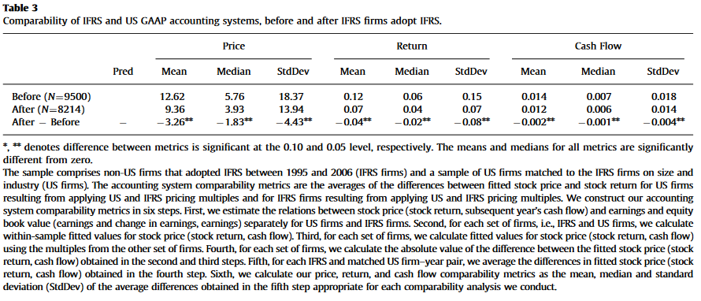
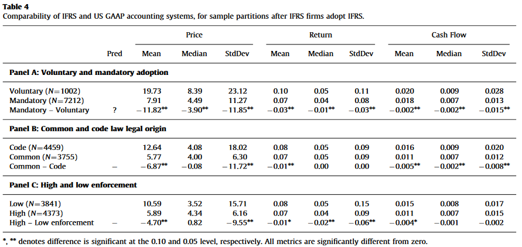
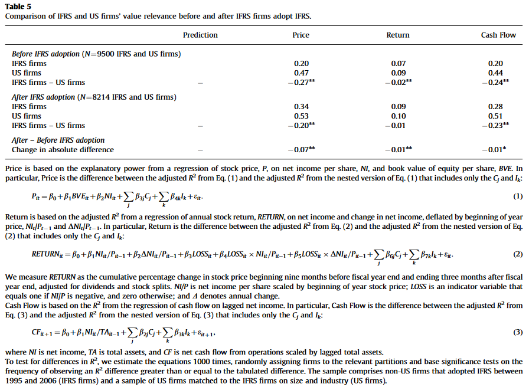
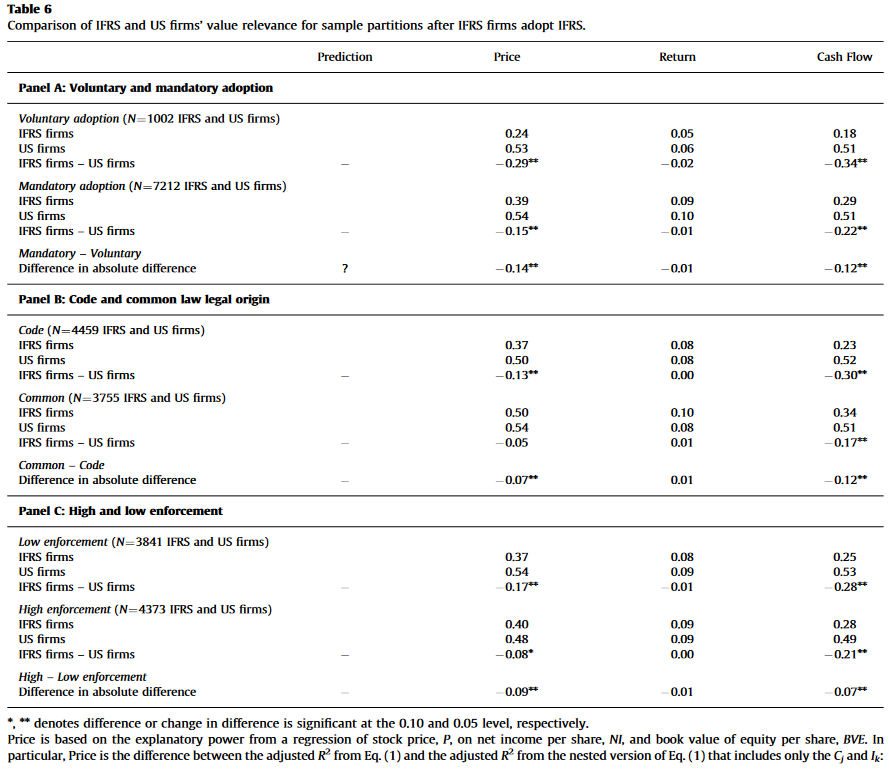
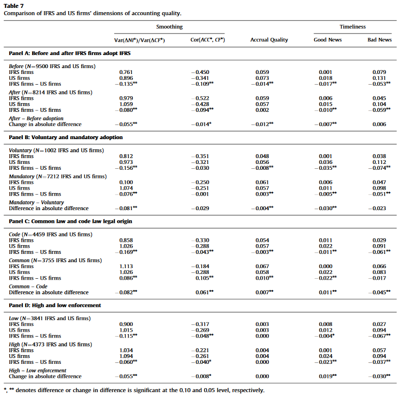
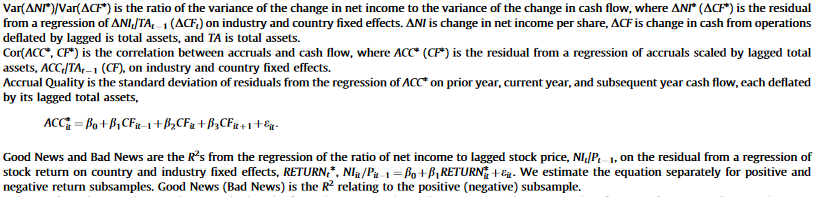

```{r setup, include=FALSE}
knitr::opts_chunk$set(echo = TRUE)
```

# Section I: Overview

## Background

 + In 2007 SEC allowed for non-US firms using IFRS to file financial statements without using GAAP
    + Implicit recognition by SEC of IFRS to sufficiently capture information comparable to GAAP
 + SEC considered universalizing a set of standards in 2008 to lead US firms to apply IFRS
 + Current adoption of IFRS by US firms seems unlikely at present:
 
  > "While it is now clear that U.S. GAAP and IFRS will continue to coexist in our public capital markets for the foreseeable future, it is just as clear that the efforts to enhance the respective standards and to reduce differences between them should continue"[^1]
  
## The Big Picture

How comparable are accounting amounts between non-US firms using International Finance Reporting Standards (IFRS) and US firms using US Generally Accepted Accounting Principles (GAAP)?

 + Use accounting system comparability - accounting amount predicting economic outcome (e.g. prices, returns, cashflows) of one system predict the same outcome of a different system?
 + Use value relevance comparability - is the same variation in outcomes the same as explained by both systems?
 + Foreign firms have greater comparability to US Firms on both measures when they apply IFRS than non-US domestic standards
 + Comparability is significantly greater for firms that adopt IFRS mandatorily in countries with common law legal orign, strong law enforcement, and more recently.


## Related Research and Contribution

Many studies have looked at this topic before. Some examples include:

 (1) Examine accounting amounts and and economic implications of non-US firms applying IFRS and domestic standards
 (2) Compare accounting amounts and economic implications of US firms applying US GAAP and non-US firms applying domestic standards
 (3) Look at non-US companies using IFRS and US GAAP (tends to be country specific and not generalizable)
 (4) Compare properties of the accounting amounts of IFRS firms listed on US markets and thus using GAAP - gives mixed results
 
 
This study differs in research design of former studies for at least four reasons:

  (1) Former studies do not include US firms. This one, by contrast, does. 
  (2) Properties of accounting amounts from reconciliation of GAAP for foreign firms are not same as application of normal US GAAP for US domestic firms
  (3) Reconciliation may have induced cross-listed firms to minimize reconciling items
  (4) Within-firm comparisons of GAAP and IFRS based accounting amounts control for factors other than accounting standards
 

# Section II: Predictions

## Comparablility before and after IFRS adoption

__Prediction 1:__ _Comparability between SEC and IFRS firms increase after IFRS firms adopt IFRS_


## Comparability after IFRS adoption

__Prediction 2:__ _There will be greater comparability for firms in countries with common law legal origns and high enforcement_


# Section III: Research Desgin

## Data

+ Use firms that adopted IFRS between 1995 and 2006. 
    + Pre-adoption as early as 1992, and post-adoption as late as 2009
+ Get IFRS firms from Worldscope, despite some classification errors. 
+ Exclude US cross-listings
+ US Firms from DataStream. Winsorize.
+ Leave out Housing Crisis period. 
+ Australia, France, Germany, and UK account for 60% of all firm-year observations
+ Mostly Manufacturing, Finance, and Service firms (76%)

## Assessing Comparability

Use following variables: stock price, stock return, cash flow (economic outcomes), earnings and book value (accounting amounts).

 + Get IFRS firms with data the year they adopt IFRS and the year before
 + Identify all US firms in the same industry as each IFRS firm
    + Minimize the aggregate size differences between IFRS and matched US firms in IFRS firm's adoption year
 + Eliminate any matched pair for which sample size differnce exceeds 50% in magnitude
 + Years are inclusive for any matched firm where for which all have data in that given year
 
Matched Sample Design that pairs similar IFRS firms with US firms helps mitigate effects of inferences on accounting and economic differences between matched firms unattributable to the financial reporting system. Additionally, mitigates the effect on inferences of industry differences in cost of capital (affects how accounting amounts relate to economic outcomes). 


__Matched Sample Design__


>A matched pairs design is a special case of a randomized block design. It can be used when the experiment has only two treatment conditions; and subjects can be grouped into pairs, based on some blocking variable. Then, within each pair, subjects are randomly assigned to different treatments.

>Imagine a matched pair design for medical testing where 1000 subjects each pair receive one of two treatments - a placebo or a cold vaccine. The 1000 subjects are grouped into 500 matched pairs. Each pair is matched on gender and age. For example, Pair 1 might be two women, both age 21. Pair 2 might be two men, both age 21. Pair 3 might be two women, both age 22; and so on. 

>For this hypothetical example, the matched pairs design is an improvement over a completely randomized design. Like the completely randomized design, the matched pairs design uses randomization to control for confounding. However, unlike the other design, the matched pairs design explicitly controls for two potential lurking variables - age and gender.[^2]


## Accounting System Comparability Metrics

Construct Accounting System Comparability as follows:

 (1) Estimate relations between stock price and earnings and equity book value separately for US and IFRS firms
 (2) For each set of firms, calculate within-sample fitted stock price
 (3) For each set of firms, calculate fitted stock price using multiples from other firms. 
 (4) For each set of firms, calculate absolute value of the difference between fitted stock price obtained in steps (2) and (3). 
 (5) For each IFRS and matched US firm-year pair, average differences in fitted stock price obtained in step (4). 
 (6) Calculate price, return, cash flow comparability metrics: mean, median, std. 
 
 
__Example:__ Stock Price


US firms stock price can be estimated as: 

$$P_{it}^{US} =\beta_0^{US} + \beta_1^{US}BVE_{it}^{US}  + \beta_2^{US}NI_{it}^{US} + \varepsilon_{it}^{US}$$ 

Similarly, estimate $P_{it}^{IFRS}$ with respect to estimates and data pertaining to $IFRS$. 

Then, calculate within-sample fitted stock price for US firms using the estimated 
$$\hat{P}_{it}^{US,US} = \hat{\beta_0}^{US} +\hat{\beta}_1^{US}BVE_{it}^{US}  + \hat{\beta}_2^{US}NI_{it}^{US}$$
And, use the $IFRS$ estimated model on the US book value of equity and net income data.

$$\hat{P}_{it}^{US,IFRS} = \hat{\beta_0}^{IFRS} +\hat{\beta}_1^{IFRS}BVE_{it}^{US}  + \hat{\beta}_2^{IFRS}NI_{it}^{US}$$
 
Repeat the above by swapping the nations for each equation. This way, we can calculate the absolute difference between fitted stock prices, stock returns, and cash flow:

$$PRICE\_Diff_{it}^{US} = \bigg | \hat{P}_{it}^{US, US} - \hat{P}_{it}^{US,IFRS} \bigg |$$
$$PRICE\_Diff_{it}^{IFRS} = \bigg | \hat{P}_{it}^{IFRS, IFRS} - \hat{P}_{it}^{IFRS,US} \bigg |$$
 
Then, the differences between all matched firm paits can be averaged. With that, calculate mean, median, and standard deviation coefficients of these averaged differences 
 
Use T-test to test for mean differences. Use Wilcoxon Rank Sum Test (nonparametric  alternative  to  the  two-samplet-test  which  is  based  solely  on  the  order  in  which  the  observationsfrom the two samples fall.) test test for median differences. Use bootstrapping to test for significant differences of standard deviations. 

_What is bootstrapping?_

> "In statistics, bootstrapping is any test or metric that relies on random sampling with replacement. Bootstrapping allows assigning measures of accuracy (defined in terms of bias, variance, confidence intervals, prediction error or some other such measure) to sample estimates. This technique allows estimation of the sampling distribution of almost any statistic using random sampling methods. Generally, it falls in the broader class of resampling methods.[^3]"

In this case, they randomly assign a US/IFRS firm to a IFRS/US firm. Then, the matched pair is randomly assigned to the subgroup. Between sample of two, calculate difference. Repeating at least 1000 times, a distribution is generated. Then, a standard deviation difference can be deemed "significant" if the sample difference exceeds 950 of the differences calculated based on the bootstrapping procedure. Requires no new data, and no distributional assumptions. Interesting to note, bootstrapping will, on average, leave unsampled about 33% of the original data.  


To test whether accounting system comparability changed after non-US IFRS firms adopt IFRS, compute accounting system comparability metrics using years before and after adoption of IFRS to compare. (_Table III_)

To test whether accounting system comparability differs after IFRS firms adopt IFRS depending on legal origin (common law vs code law) and mandatorily (i.e., law enforcement), partition firm-year observations after adopting IFRS into demarcated groups and calculate separate accounting system metric for each group (_Table IV_). 





__Results:__

 + Price, Return, and Cash Flow comparability metrics are significantly different from before and after IFRS firms adopt IFRS. 
 + Firms which madatorily adopt IFRS have greater comparability with US firms - must be more consistent in application and enforcement of the law. 
 + Generally the case that comparable standards are more likely in countries with common law. 
 + Higher enforcement entails more comparability.

## Value Relevance Comparability Metrics


This test uses explanatory power of regressions to see if the variation between US and IFRS firms is consistently explained for an economic outcome. 





__Results:__

 + Difference in value relevance decreased significantly from when IFRS firms applied non-US domestic standards to when they applied IFRS. 
    + Consistent with prediction that value relvance is higher for US firms than for IFRS firms before they adopt IFRS. 
    + fter IFRS firms adopt, value relevance is higher for US firms, significantly for price and cash flow. 
 + Table 6 shows similarly story of Table 3, but returns are never signficant. 
 
 
## Accounting Quality

__Goal:__ Look at potential sources of differences in comparability across dimensions of accounting quality. Previous literature has provided three areas of assessing quality: earnings smoothing, accrual quality, and earnings timeliness. 

__Earnings Smoothing:__ Adjusting fluctuations on realized earnings. The first metric looks at the variance of the change in net income over the variance in the change in cash flows. A higher ratio suggests less earnings smoothing. Second metric is correlation between accruals and cash flows. 

__Accrual Quality:__ Size of accruals can be used as a measure of quality since accruals can be used for manipulation. Their measure regresses accruals on lagged cash flows. Lower standard deviation on residuals indicative of higher quality. 

__Timeliness:__ Metrics are Good News and Bad News measured by $R^2$ from regression of net income scaled by begiining of year price on residual from regression of stock return on country and industry fixed effects ($RETURN^*_{it}$). Higher $R^2$ is sign of greater timeliness. 






__Big picture:__ All post-adoption sample periods, except for common law firms, show accounting amounts of US firms exhibit higher quality than IFRS firms. Quality differnce is smaller between US and IFRS firms for mandatory adopters in high enforcement countries. 

## Additional Analysis

(1) Look at differences in regression coefficients used in constructing the comparability metrics
(2) Repeat Analysis in 2005-2006, 2007-2009
(3) Test for globalization using non IFRS firms who can't implement it
(4) Test to see if three largest industries (Finance, Manufacturing, Services) account for most of the results


- Differences in Regression coefficients used in constructing the comparability metrics for IFRS and US firms are smaller after IFRS firms adopt IFRS and for post-adoption sample partitions that exhibit greater comparability. 
- Comparability greater in recent years
- Globalization does not explain findings
- Some significant increases in value relevance for the three big sectors consistent with overall sample, with some exceptions in finance sector


# New Information in Earnings - Ball and Shivakumar 2008

- How impressed should we be by $R^2$? Is such an account convincing?
- Danger of trying to fit best models?
- Other ways of model specification?


[^1]: SEC, "A U.S. Imperative: High-Quality, Globally Accepted Accounting Standards", 5 January, 2017, https://www.sec.gov/news/statement/white-2016-01-05.html

[^2]: https://stattrek.com/statistics/dictionary.aspx?definition=matched%20pairs%20design
[^3]: https://en.wikipedia.org/wiki/Bootstrapping_(statistics)