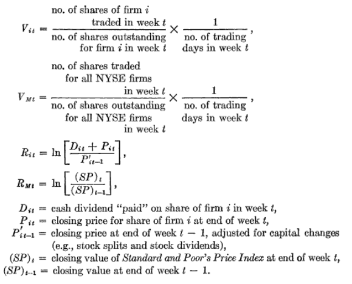

```{r setup, include=FALSE}
knitr::opts_chunk$set(echo = TRUE)
```

# Research Question and Hypothesis

_To what extent do common stock investors perceive earnings to possess information value?_

_If earnings reports convey information in the sense of leading to changes in equilibrium value of the current market price, the magnitude of the price change (without respect to sign) should be larger in week $0$ than during the nonreport period_

_If earnings reports convey information in the sense of leading to changes in portfolios of investors, the volume of trades of a security should be larger in week $0$ than during the nonreport period_

# Motivation and Target Audience

+ Theory of valuation (such as work from MM) suggests earnings are relevant
+ Many researchers say earnings has no value, since:
    (1) Measurement error of earnings is prevelant, need an instrumental variable
    (2) Earnings are too slow - investors get same information in timelier manner through another mechanism
+ Then the utilitY of accounting is on the line

Former research like that of Benston 1967 suggest that earnings are not valuable. However, this could be because no relationship exists, or model is mis-specified. 

Here, Beaver tries to uncover the true case without specifying expectations of investors through a model requiring such assumptions. Then, the question is not should investors pay attention to earnings, but _do_ they?

# Research Design 

Information should not only be captured in changing prices, but also volume. So, information is meaningful if not only the prices change but also large volume of trades. 

_An important distinction between the price and volume tests is that the former reflects changes in the expectations of the market as a whole while the latter reflects changes in the expectations of individual investors._ (pg 69). Perhaps, according to footnote 9 two things are important when they talk about price and volume - that they are analogs to efficiency and unbiasedness. 

 (1) Volume Analysis unadjusted for market influences
 (2) Volume Analysis adjusted for market influences. Perhaps adjusting for market may help isolate effects of earnings for a firm, and help reduce noise
 (3) Price Analysis adjusted for market-wide events

# Data and Sample

__Data Exclusion__

 (1) Compustat firms
 (2) NYSE firms
 (3) Fiscal Year end on day other than December 31 to avoid clustering announcement dates during any time period ($\frac{2}{3}$ firms are 12/31 firms). Such large clustering will influence market-wide events, which is an important component of the model. Then, the effects of the announcement are lost .
 (4) No dividends
 (5) No stock splits
 (6) Less than 20 reports by WSJ
 
 Then, there are 143 firms left with 506 earnings announcements from 1961 to 1965

__Variables__




# Model and Econometrics


## Volume Analysis unadjusted for market influences
Looks at average volume across all firms first. 

## Volume Analysis adjusted for market influences

$$V_{it} = a_i + b_iV_{Mt} + e_{it}$$
Conducts residual analysis:

$$e_{jt} = V_{jt} - a_i - b_iV_{Mt}$$
for $i = 1,...,143$ firms, $j = 1, ..., 506$ announcements and $t = -8, ..., 8$ weeks.

Intuitively, $e_{it}$ is portion of security's volume not explained by the market. 

Figure 2 shows the average volume using $e$ of 143 firms/obs in nonreport period
Figure 3 shows the above equation, which is averaged across earnings windows for 506 announcements. 

The "nonreport" period values only have 4 firms above the .33 height for $e_i$ found in Figure 3. Difference is understated, due to number of obs. If there were 506 obs in fig 2, then dispersion would be less and number above .33 would be fewer (pg 77). 

Compared frequency of positive residuals in each report week with those in nonreport week. Chance of observing as many positive residuals in $0^{th}$ week is 1 in 100,000. So, conlcude that the volume in week 0 is unusually high. 

Might be some bias since they excluded 209 report dates (from 715 leaving 506). So, this effect could carry over in nonreport dates where remaining 209 are still included. Could give bias against earnings reports since volume of activity is increased in nonreport periods. But, could be slim since activity before week 0 peak are generally negative. 

## Price Analysis adjusted for Influence of Market-Wide Events

Use Sharpe model to control for market price changes:

$$R_{it} = a_i + b_iR_{Mt} + u_{it}$$

What are we looking for? _If earnings reports possess information content $u_{it}^2$ should be greater during week 0 than during the nonreport period_.

Note that the mean of $u_{it}^2$ during the nonreport period is simply the variance of that variable $s_i^2$. Then, let $U_{it}$ be the ratio between squared residual in week $0$ and average squared residual during nonreport period. 

_Prediction: mean of U will be greater than one during week 0 if earnings reports possess information content._

__Price Residual Analysis__

$$u_{jt} = R_{jt} - a_i - b_iR_{Mt}$$


$$U_{jt} = \frac{u_{jt}^2}{s_i^2}$$
for $i = 1,...,143$ firms, $j = 1, ..., 506$ announcements and $t = -8, ..., 8$ weeks.


# Results

Looking at volume, controlling for the market or not still leads to a large increase in volume of trades during release of announcement. After controlling, one can look to residuals to see portion of volume not explained by market, which is still quite high. 

Looking at prices and their residuals, price activity is highest in week $0$, much larger (67%) than the average during the nonreport period. They are also above average before the announcement, and for two weeks after the announcement. 


# Review

## Strengths and Weaknesses

__Strengths__

+ Strong first look at the information content
+ Robust to take into account volume and prices

__Weakness__

+ Does not look at industry effects
+ Weekly


## Conclusions supported by evidence?

+ Yes

## Unresolved Questions and Future Investigations

+ Can we consider other microstructure variables? Illiquidity and Volatility?
+ What happens in the weeks before where trading activity rises?