```{r setup, include=FALSE, fig.align='center'}
knitr::opts_chunk$set(echo = TRUE)
```

# Overview of Concepts and Critiques

## Summary - Blankespoor, Linsmeier, Petroni, and Shakespeare (2013)


- Traditional Measures of Bank credit risk under GAAP employ historical costs and a mixed-attribute model
    - Some supporters of these measures, including the American Bankers Association believe fair values can be transitory due to changes in credit risk, liquidity, and interest rates. However, use debt until full maturity, so these costs will not be essential and potentially misleading
- At the time of this article, FASB looked into proposals to employ greater use of fair value
- These authors compare the ability of leverage measured under different methods of accounting to reflect credit risk in the banking industry using bond yield spread and bank failure as a measure of credit risk regressed on fair value, fair value and historical (amortized) costs, and fewer fair value and more historical costs (Tier 1) regulatory captial. 
- Authors find relationship between credit risk and leverage get stronger as the amount of financial instruments measured at fair value increases


## Difference of Fair Values and Net Historical Costs - CMY

(1) Fair values consider all expected credit losses, whereas loan loss reserves tend to foucs only on incurred credit losses
    - Expected Cash flow for two measures differ
(2) Loan fair values change and can shift away from historical costs when discount rate or market risk premium tied to credit quality of banks changes
(3) Loan fair values can change when market-wide interest rates unrelted to credit quality change (such as changes in term structure)

## Cons of Fair Value according to BLPS

Arguments against fair value:

(1) Fair Value accounting for assets that are instrument held for collection does not faithfully represent a bank's financial condition. 
(2) Fair value accounting for liabilites that are instruments held for payment is not appropriate because
    (i) Few opportunities for firms to settle liabilities before maturity at other than the pricnipal amount (illiquidity)
    (ii) Counterintuitive that under fair value accounting for fixed-rate debt, an increase in credit risk results in a write-down of the value of the debt and a gain in net income
(3) Financing of a bank's operations links loans issued with the deposits received, and one can best capture economics of the banking model if loans and deposits are similarly measured.
(4) When fair values must be estimated, the valuation process can be significantly complex, and the resulting numbers sufficiently unreliable to cause benefits not to outweigh the costs
(5) Fair value accounting contributes to procyclicality of financial system, which is a cause of the Great Recession - therefore it is harmful


## BLPS motivation

- Fair value research appears good in equity markets, but no one has looked at credit risk, and the two asset classes are sufficiently different such that it requires careful evaluation. 


## CMY Pros

- Fair values are based in theory upon market prices or other market inputs, and market participans will pay more for cash flows with a lower credit risk. 

## CMY Cons

(1) Active markets for most bank loans do no exist
    - Subjective and not reliable
(2) loan fair values are not a relevant measure attribute because the vast majority of loans are held for collection and are not sold, even if borrowers experience financial difficulty
(3) Fair values are disclosed only in notes and not financial statements


__Question:__ Give the apparent trouble of calculating fair value, how do they do it for their research?
   
   
# BLPS Empirical Design


__Defintion:__ Measure leverage with the _Tangible Common Equity_ or TCE approach to leverage which is defined as (assets - intangible assets + mortgage servicing rights) / (assets - intangible assets + mortgage servicing rights - liabilities - preferred stock)

__Leverage:__ Use three different measures: Fair Value, GAAP, and _TIER1_ (inverse of Tier 1 leverage ratio)

    
    
<br>

Notice the three measures of leverage they test - examines well the gradual decrease in using fair value

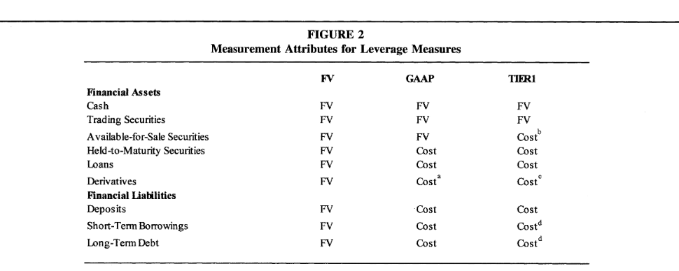/


__Credit Risk:__ is measured by Bond Yield Spreads (yield at the time the bond is issued or traded less Treasure rate for bond of similar maturity) and bank failure 

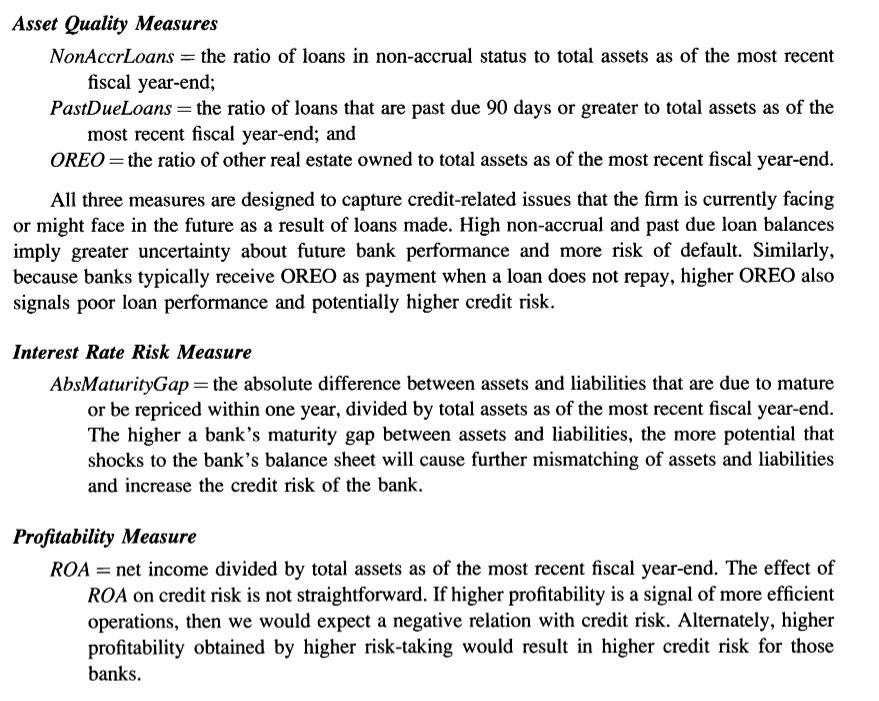/

__Basic Regression:__ regress yield spread on three leverage measures as of most recent fiscal end, plus variables above. 

In subsequent regressions, they also consider the following dependent variables to gain further insight into the relation between fair values and bond yields. These categories "drive the dominance of FV":

(1) FVLoans - leverage based on GAAP amounts except for loans, which are measure at fair value
(2) FVSec - same as above, except using securities
(3) FVOA - other assets
(4) FVDep - deposits
(5) FVOL - other liabilities

__Bank Failure:__ 

In addition to making plots, they use univariate (with different leverage measures) and multivariate logit regressions [^1] (with _NonAccrLoans, PastDueLoans, OREO, AbsMaturityGap, ROA, LnAssets_). They look at 1, 2, and 3 years prior to failure.


## FYI

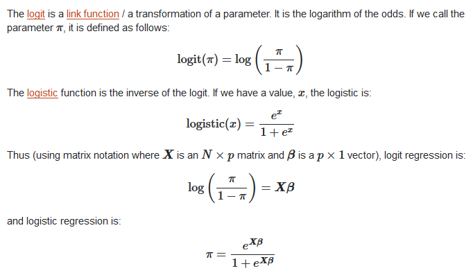/ 


# CMY Empirical Design


## Independent Variables

(1) Net Historical costs of loans (_LOANHC_)
(2) Fair Value of Loans (_LOANFV_)
(3) Difference between reported loan fair values and net historical costs (_FVDIFF_)

## Proxies for Credit Loss

(1) Net Chargeoffs (_CO_) represents amount of loans written off as uncollectible in a year, net of any recoveries. Represents recognition in the bank's financial statements that loan payments will not be collected
(2) Non-performing Loans (_NPL_) - loans that have been modified in a troubled debt restructuring, past due, or for which interest revenue is not currently being recorded. 
 
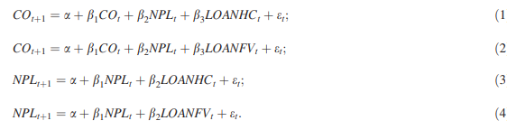/  
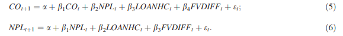/


__Prediction Tests: Logistic Regression__

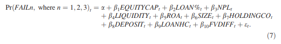/


__Out of Sample:__ Use actual out of sample prediction to evaluate ability of fair value vs historical value (NICE!)


# BLPS Table 2


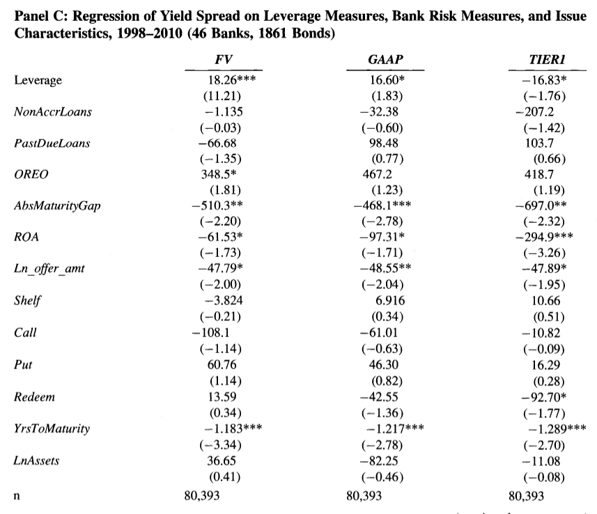/
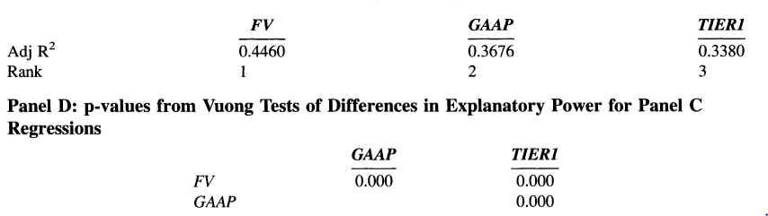/


# CMY Table 3 and 4

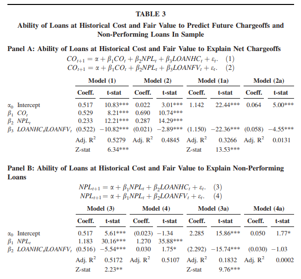/
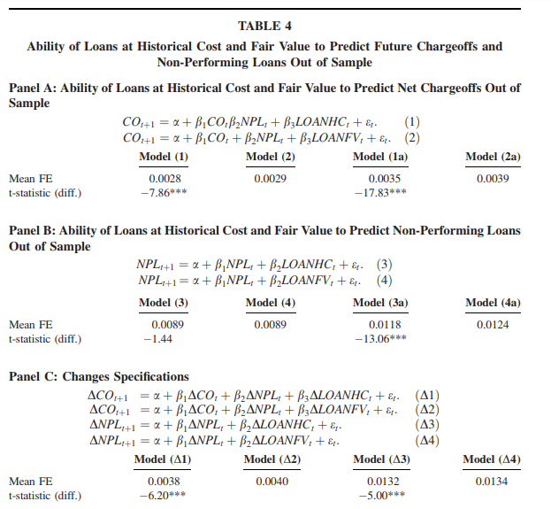/

****************************************************


    
    
# BLPS Table 7

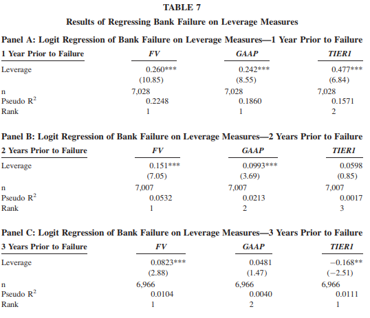/

[^1]: By multivariate I believe they mean multivariable in terms of independent variables


# CMY Table 6

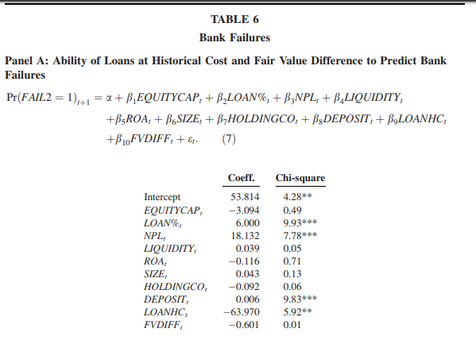/
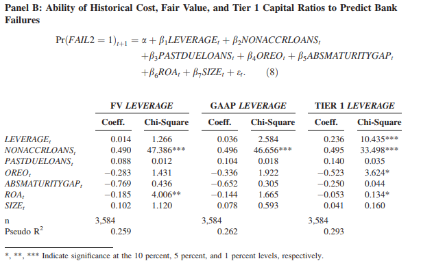/


