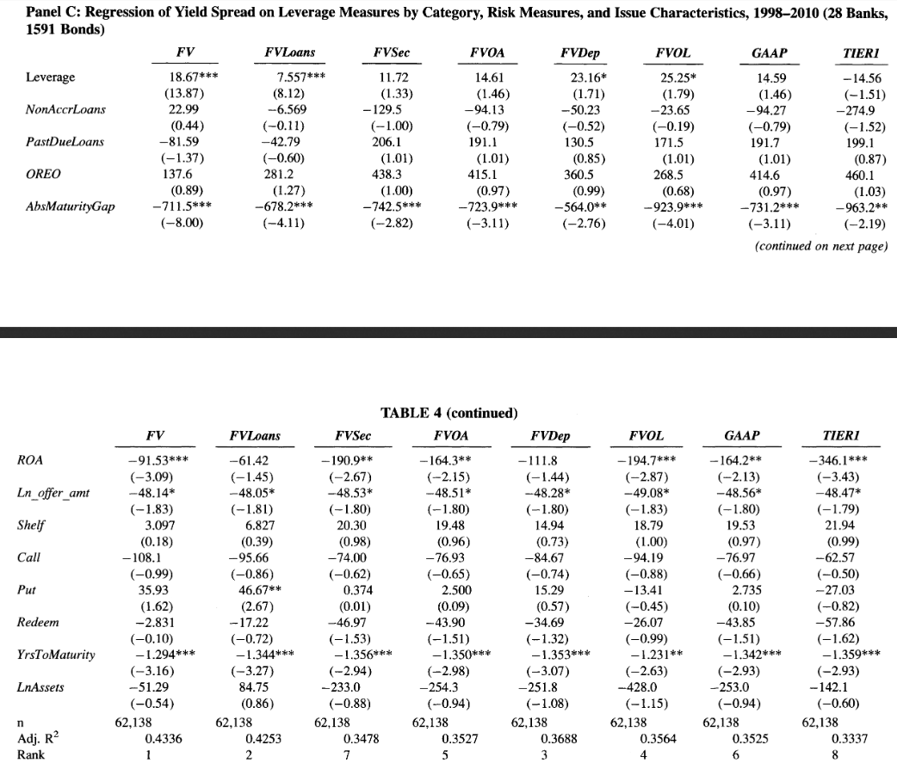

```{r setup, include=FALSE, fig.align='center'}
knitr::opts_chunk$set(echo = TRUE)
```


## Executive Summary


- Traditional Measures of Bank credit risk under GAAP employ historical costs and a mixed-attribute model
    - Some supporters of these measures, including the American Bankers Association believe fair values can be transitory due to changes in credit risk, liquidity, and interest rates. However, use debt until full maturity, so these costs will not be essential and potentially misleading
- At the time of this article, FASB looked into proposals to employ greater use of fair value
- These authors compare the ability of leverage measured under different methods of accounting to reflect credit risk in the banking industry using bond yield spread and bank failure as a measure of credit risk regressed on fair value, fair value and historical (amortized) costs, and fewer fair value and more historical costs (Tier 1) regulatory captial. 
- Authors find relationship between credit risk and leverage get stronger as the amount of financial instruments measured at fair value increases


## Beginning Concepts

__Question__: _What is distinction between fair value and market value?_

Fair Value : Price that is fair between both the parties. Mutually beneficial value.

Market Value : Demand and Supply driven price. 


__Some Lessons from Finance literature[^1]:__

_Why book leverage?_

- Managers focus on book leverage because debt is better supported by assets in place than it is by growth opportunities (Myers, 1977).
- Financial markets fluctuate and managers are said to believe that market leverage is an unreliable guide to corporate financial policy.
- Managers do not rebalance capital structure in response to equity movements because of adjustment costs (Graham and Harvey, 2001).

_Why market leverage?_

- Book value of equity is primarily a "plug number" used to balance the left-hand side and the right-hand side of the balance sheet, rather than a managerially relevant number (Welch, 2004).
- Book value of equity can even be negative (although assets cannot be).
- Book leverage is backward looking since it measures what has taken place; market leverage is more forward looking.
- Further, debt can be defined as long-term or total debt, and it can be defined to include accounts payable or all liabilities.


## Basic Bond Concepts


Some of the terminology used in connection with bonds is:

- The issuer is the entity (company or government) who borrows the money by issuing the bond, and is due to pay interest and repay capital in due course.
- The principal of a bond - also known as maturity value, face value, par value - is the amount that the issuer borrows which must be repaid to the lender.[2]
- The coupon (of a bond) is the annual interest that the issuer must pay, expressed as a percentage of the principal.
- The yield is the rate of return the bond generates - not the same as coupon.
- The maturity is the end of the bond, the date that the issuer must return the principal.
- The issue is another term for the bond itself.
- The indenture, in some cases, is the contract that states all of the terms of the bond.
- Bond Yield Spread is the yield of the bond at issue less the treasury rate for similar maturities


Just as options are traded on volatility, bonds are traded on interest rates. 

- As the the bond price increases (decreases) the interest rate on the bond decreases (increases)
- Pull to Par is the effect in which the price of a bond converges to par value as time passes. At maturity the price of a debt instrument in good standing should equal its par (or face value).
    - Another name for this effect is reduction of maturity.
    - It results from the difference between market interest rate and the nominal yield on the bond.
    - The Pull to Par effect is one of two factors that influence the market value of the bond and its volatility (the second one is the level of market interest rates). 


__Key Point:__ Investors hope to sell at a lower (higher) interest rate (price) to make a profit. Buy and hold bond investors, who say use coupons as regular income, should be indifferent all else being equal, since pull to par will guarantee return of the face value of their debt at the appropriate average interest rate. 

When you invest in a bond and hold it to maturity, you will get interest payments, usually twice a year, and receive the face value of the bond at maturity. If the bond you choose is selling at a premium because its coupon is higher than the prevailing interest rates, keep in mind that the amount you receive at maturity will be less than the amount you pay for the bond.

When you buy and hold, you need not be too concerned about the impact of interest rates on a bond's price or market value. If interest rates rise, and the market value of your bond falls, you will not feel any effect unless you change your strategy and try to sell the bond. Holding on to the bond means you will not be able to invest that principal at the higher market rates, however.


__Claim:__ This appears to be the reason why some institutions like the ABA would object to using fair value


__Question__: _Why should we care about the bonds/leverage/credit risk? Why does it take center stage in this paper?_

- Fixed Income markets globally exceed \$100 trillion, where equity stands at around \$65 trillion.

- Authors give three reasons too:
    (1) Analysis of equity markets will not carry over to credit markets
          - Equity rises on earnings, but not necessarily bonds 
          - Volatility hurts bonds, but could help equity 
    (2) Allows for better analysis of bank failure - probably a topic of great interest when this paper was started
    (3) Bond yield spreads may be more informative 
    
    
    
## Empirical Musings

__Defintion:__ Measure leverage with the _Tangible Common Equity_ or TCE approach to leverage which is defined as (assets - intangible assets + mortgage servicing rights) / (assets - intangible assets + mortgage servicing rights - liabilities - preferred stock)

__Credit Risk__ will be measured by bond yield spreads and ban failure
    
    
<br>

Notice the three measures of leverage they test - examines well the gradual decrease in using fair value

/
    
    
    
   
## Table 2

/
/
/

__Note:__ They claim to use a multivariate regression, but this does not appear to be the case. What they do use is a multivariable equation in panel (c) whereas they only have one variable (what they call univariate) in panel (a). 


## Table 4

### Some new variables:

(1) FVLoans - leverage based on GAAP amounts except for loans, which are measure at fair value
(2) FVSec - same as above, except using securities
(3) FVOA - other assets
(4) FVDep - deposits
(5) FVOL - other liabilities


/

    
    
    

[^1]: From Kathy Kahle's Finance 601 class notes - describing Frank and Goyal's analysis (2009)

