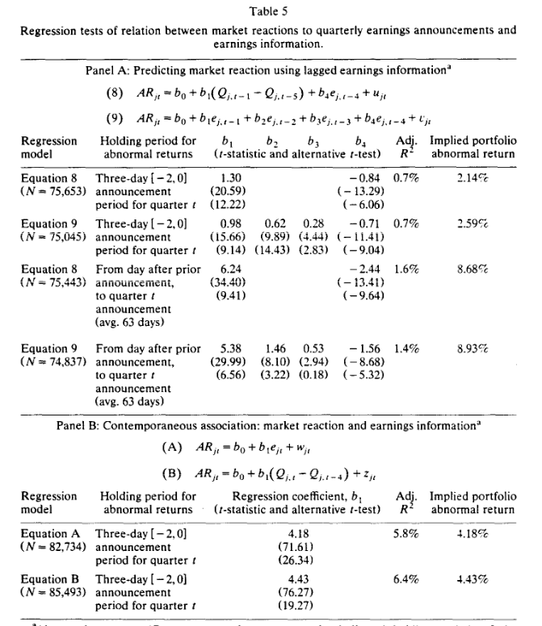
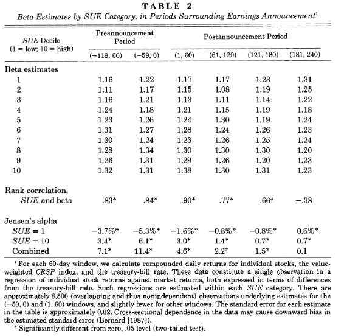

```{r setup, include=FALSE}
knitr::opts_chunk$set(echo = TRUE)
```


# Time Series Review

## Random Walk with Drift

The authors in this paper examine a model they refer to as a random walk with trend. However, given the setup in equation $(1)$ on page 312, it appears they refer to what others have called a random walk with drift. Though a drift is different than a trend (since a trend is a function of time, i.e. $\delta t$), it appears that a random walk with drift is used to describe a trend, and can even be derived into the typical trend form dependent on time $t$. 

From Shumway and Stoffer's _Time Series Analysis and Its Applications_ page 11-12: [^1]

> A model for analyzing trend is the random walk with drift model given by:

$$x_t = \delta + x_{t-1} + w_t$$


> for $t=1,2,...,$ with initial condition $x_0 = 0$ and where $w_t$ is white noise. The constant $\delta$ is called the _drift_, and when $\delta = 0$ the equation is simply called a random walk. The term random walk comes from the fact that, when $\delta = 0$, the value of the time series at time $t$ is the value of the series at time $t-1$ plus a completely random movement determined by $w_t$. Note that the above equation may be rewritten as a cumulative sum of white noise variates. That is:

$$x_t = \delta t + \sum^t_{j=1} w_j$$

> for $t = 1,2, ...$


```{r}
set.seed(154)
w = rnorm(200); x = cumsum(w)
wd = w + .2; xd = cumsum(wd)
plot.ts(xd, ylim = c(-5, 55), main = 'random walk', ylab = '')
lines(x, col=4); abline(h=0, col=4, lty=2); abline(a=0, b=.2, lty=2)

```


__Question:__ Why is inclusion of a trend or drift a good specification for the context of earnings models such as the one in this paper?


## Seasonality


Time series datasets can contain a seasonal component.

This is a cycle that repeats over time, such as monthly or yearly. This repeating cycle may obscure the signal that we wish to model when forecasting, and in turn may provide a strong signal to our predictive models.

Model for seasonal data[^2]:

$$x_t = S_t + W_t$$
Where $S_t$ is a seasonal component that varies slowly from one quarter to the next according to a random walk:

$$S_t = S_{t-4} + Z_t \implies S_t - S_{t-4} = Z_t$$
With $W_t$ and $Z_t$ being uncorrelated white noise processes. 


__Question:__ Why is seasonality important to consider?


# Hypothesis Development and Tests


## Key Question

_What explains the post-earnings announcement drift?_

## Background

- Paper investigates possibility that stock prices fail to reflect the full implications of future earnings
- Prices do not adequately reflect the extent to which earnings deviate from a seasonal random walk model
- Perhaps reactions of prices to future earnings are predictable

__Question__: Why are the first and second statements so "surprising" in the words of the authors?


## Main Results and Contribution

__Key Findings:__

- Stock prices are partially influenced by _naive expectations_ allow for accurate predicting of three-day reaction to future earnings announcements given only current information about historical time series
- There is a positive relation between unexpected earnings for quarter $t$ and post-announcement drift for quarter $t+1$
- There is a negative relation between unexpected earnings and abnormal returns around announcement of earnings for quarter $t+4$

__Contribution__

(1) Gives signs and magnitudes of reactions to subsequent earnings announcements to the historical autocorrelation structure of earnings (could help sort out cause of post-announcement drift)
(2) Evidence given in this paper creates added obstacles to contentions that drift might ultimately be explained by errors in the methodology used to estimate expected returns


>_The nature of the evidence is also distinct in an important way from that in the growing body of other studies that question semi-strong or weak-form market efficiency. Previous studies make vague predictions. By linking what appears to be the elimination of descrepancy between prices and fundamentals to prespecified information events, this study gives evidence that a market-efficiency anomaly is rooted in a failure of information to flow completely into price. Even in a maret where prices fail to reflect all available information, one can still observe unusual stock-price activity concentrated around news releases. The puzzling question is, if a portion of the news became predictable months earlier, why did the associated price movements not occur then?_(308)

__Question:__ Does this paper assume market efficiency or inefficiency?

__Question:__ The authors above use the word predictable. Another session's paper discusses Granger Causality. Methodologically, how much should we value simply predictable to causal? 

SP Kothari writes:

>In addition to potential risk measurement and data problems discussed above, there is another challenge in drawing definitive conclusions about market efficiency. While much of the research concludes market inefficiency, further progress will be made if researchers develop a theory that predicts a particular return behavior and based on that theory design tests that specify market inefficiency as the null hypothesis . Researchers should then design powerful tests that fail to reject that null hypothesis. An excellent example of such research is Bernard and Thomas (1990), who specify stock-price behavior under a naive earnings expectation model as well as a sophisticated earnings expectation model. However, there is still a need for a well-developed theory of naive investor behavior that can be subjected to empirical testing in other contexts.[^3]

__Question__: Do you believe, like Kothari, that Bernard and Thomas 1990 constitute an "excellent example" of research which specifies market inefficiency as a null hypothesis?


## Hypothesis 1


__Definition:__ A key measure is _standardized unexpected earnings_ defined as actual earnings minus expectation based on seasonal random walk with trend (detrended seasonal difference in earnings) divided by standard deviation of the unexpected earnings defined in the numerator over trend estimation period. 

_Table 1_ shows the time-series behavior frequently demonstrated by many studies: First 3 autocorrelations are positive, though diminishing, and the fourth is negative. 


Consider the behavior of stock prices in a market where earnings expectations fail to reflect the pattern described in Table 1. Use a seasonal random walk with trend. 

__Equation 1__:
$$\mathbb{E}^M[Q_t] = \delta + Q_{t-4}$$

Together with an earnings response coefficient $\lambda$, we have abnormal return described by:

__Equation 2__:

$$AR_t = \lambda(Q_t - \mathbb{E}^M[Q_t]) = \lambda ( Q_t - Q_{t-4} - \delta)$$

The abnormal return reflects a component equal to the current detrended seasonal difference in earnings. 

__Hypothesis 1:__ _If the prices reflect an earnings expectation described by a seasonal random walk with trend, there should be positive but declining associations between the abnormal return at the announcement of quarter t eachings and the detrended seasonal differences in earnings for quarters t-1, t-2, and t-3. There should be a negative association between the abnormal return at the announcement of quarter t eachings and the detrended seasonal difference in earnings for quarter t-4._


## Empirical Test of Hypothesis 1

__Claim:__ If Hypothesis 1 is correct, then we should observe a positive relation for each of the next three announcements but with the magnitude of the association decline over the three quarters and a negative relation for the fourth subsequent announcement. 

__Test:__ Form portfolios that are long in extreme good news (SUE = 10) and short in bad news (SUE = 1) based on quarter $t$ earnings information. Measure mean abnormal returns for portfolios around subsequent earnings announcements. 

__Question:__ Why are two t-tests presented in _Table 2_? Why is one smaller than the other?

__Result:__ Three-day abnormal returns around earnings announcements are predictable as seen in Panel A of _Table 2_. Signs and magnitudes lend support of Hypothesis 1. 


__Question:__ What question is Panel B of _Table 2_ trying to answer? What is the result? (page 319 to 320)


__Test:__ Is the result driven by extreme deciles? Use correlations. 

__Result:__ Panel C shows relation between SUE deciles for quarter $t$ and corresponding mean abnormal returns around next four announcements is monotonic and almost linear. 


__Question:__ How could firm size be driving the results? (321)

__Question:__ Are patterns exhibited in _Table 2_ similar to those in _Table 4_? Which size firm are results the strongest?


__Claim:__ Data are consistent with stock prices failing to reflect fully the implications of current earnings for future earnings for all firms, but the failure is more apparent for small stocks. 


## Hypothesis 2

_If prices reflect an earnings expectations described by a seasonal random walk with trend, while the univariate time-series process of earnings is best described by the Brown-Rozeff (1979) model in equation (3), then the abnormal return at the announcement of quarter t earnings should have a positive partial correlation with the seasonal difference in earnings for quarter t-1, and a negative partial correlation with the earnigns shock of period t-4, as specified in equation (6). Alternatively, the abnormal return at the announcement of quater t earnings should have positive but declining partial correlations with the earnings shocks of quarters t-1, t-2, t-3, and a negative partial correlation with the earnings shock of period t-4 as specified in equation (7)._

__Question:__ How is hypothesis 2 different from hypothesis 1? (315).


__Equation (6):__


$$AR_t = \lambda \varepsilon_t + \lambda \phi (Q_{t-1} - Q_{t-5}) + \lambda \theta \varepsilon_{t-4}$$

__Equation (7):__

$$AR_t = \lambda \varepsilon_t  + \lambda \phi \varepsilon_{t-1} + \lambda \phi^2 \varepsilon_{t-2} + \lambda \phi^3 \varepsilon_{t-3} + \lambda(\theta + \phi^4) \varepsilon_{t-4} + \lambda \nu$$


where $\nu$ represents uncorrelated prior period shocks. Included in both models is a first order autoregressive term preceded by $\phi$ which accounts for positive but decaying autocorrelations in seasonally differenced earnings at lags 1 through 3. There is also a seasonal moving average term preceded by $\theta$ to account for negative autocorrelation in fourth lag. 

Derivations available on page 313 - 314. 


## Empirical Test of Hypothesis 2

Estimate regressions of following form:

$$AR_{jt} = b_0 + b_1(Q_{j,t-1} - Q_{j,t-5}) + b_4e_{j, t-4} + u_{jt}$$
$$AR_{jt} = b_0 + b_1 e_{j, t-1} + b_2 e_{j,t-2} + b_3 e_{j, t-3} + b_4 e_{j, t-4} + v_{jt}$$

__Note:__ Sample is too short to iteratively estimate the time series model here. To deal with this, they first partition the data into a subset of 26 historical observations, and they also use the full sample but substitute forecast errors from alternative Foster model. This weakens the test. 





__Note:__ Panel B suggests that the abnormal return that can be predicted in advance is approx. half as large as the stock-price reaction to what is labeled unexpected earnings in many accounting studies. 


This holds true for firm size categories as well. 


## Other Considerations (page 331)

(1) _Can this evidence be explained in terms of rational investors desire to await confirmation that a previous earnings change is not transitory?_ No, not consistent with quarter $t+4$. 

(2) _Does the evidence reflect autocorrelations in earnings that were observable ex post, but not predictable ex ante?_ No, how could it not get it right year after year?

(3) _Transaction Costs?_ No, why would it last?

(4) _Design flaw - risk?_ No way! Because that would be weird


# Post-Earnings-Announcement Drift: Delayed Response or Risk Premium

- Maybe a portion of price response to new information is delayed, or maybe there is a misspecified CAPM. 
- For the latter, BKW suggests betas shift upward or downward for firms with high/low unexpected earnings
- For the former, it could be transaction costs, or investors may not realize full implications of announcement earnings. 
- Authors conclude it cannot be misspecified CAPM





[^1]: Available for download at https://www.stat.pitt.edu/stoffer/tsa4/tsa4.pdf

[^2]: https://www.stat.berkeley.edu/~gido/Removal%20of%20Trend%20and%20Seasonality.pdf

[^3]: Kothari, SP, "Capital Markets Research in Accounting", _Journal of Accounting and Economics_, 31, 2001, pg 191. 

