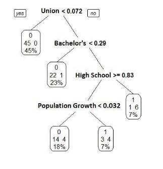

```{r setup, include=FALSE}
knitr::opts_chunk$set(echo = TRUE)
```

## Idea 1


On page 124 of Kothari 2001, he discusses promising areas for future research in regards to predicting earnings response coefficient magnitudes. In particular, he talks aboiut how rigorous theories for time-series properties of this topic do not exist. Furthermore, he cites one area of promising research is to link earnings response coefficient literature (using time series) to economic determinants "like competition, technology, innovation, effectiveness of corporate governance, etc". 

Many of these variables related with earnings would appear to me to be rather endogenous. Perhaps it is out of fashion these days, but I think some exploration between earnings coefficients and economic determinants could be had with a multivariate time series model, such as a vector autoregressive process or, if needed (provided that these processes are cointegrated), a vector error correction model. 

Using such a model, one could see how significant present and lagged variables are for earnings, and earnings for other variables being tested. One variable, of course, would be the earnings response. I would need to immerse myself more in the literature to find out what may be relevant for testing as well. If nothing, perhaps univariate is good enough. However, to truly test the economic determinants, like innovation, one could specify an exogenous "shock" variable representing one of these economic determinants. Then, I would use dynamic multiplier analysis to measure the impact of this shock to the earnings. Such method would allow one to measure the effect of something like innovation. In the case that a variable maybe endogenous, one could still measure the shock through impulse response. Careful consideration is still needed to design the model, however. Yet, I believe that these multivariate time series models can be quite good in exploring the relationships between these variables. 


_____________________________________________________

## Idea 2


Ball and Brown (1968) identify good news and bad news in for a firm and the informational value of it. Although a departure from their approach, I think classifiers could be a strong way to sort out both important sources of information for firms, and which sources are more relevant to bad news and good news. In other words, one classifying test would see, for the whole, which variables are most important for contributing to information captured in stock prices. Secondly, one could tease out differences between informational sources based on firms with good earnings versus ones with bad (negative) earnings. 

Such test could be well suited for a simple classification tree, an algorithmic modeling technique which allows for far better classifying capabilities than traditional methods such as log regressions. Unlike other black box machine learning techniques, in the words of Leo Breiman "classification trees get an A+ for interpretability"[^1]. One gives up the usual effect informed by coefficients and p-values. However, one gains on predictive accuracy harnessed through crossvalidation on randomized training and test sets. If accuracy is to be valued, and not solely conformability to data models of ages past, then this is a promising method.



By way of example, this tree was grown to try to predict which cities enact minimum wage laws based on a host of determinants. Only 4 of the 22 came out as having predictive power, with the most important at the top and less at the bottom. The tree guides the way of where to go based on thresholds, and gives an exact tally with 1's (new minimum wage law enacted) and 0's (no new law). For example, 45% of cities with minimum wage laws have union memebership of less than 7%. 

I think for identifying, this technique, when appropriate, could play an important role in the future with economic modeling. Granted, it cannot be the only model, and it may experience push back from the powers that be. Yet, this, along with random forests, support vector machines, LASSO, and many more will play an important role in the future. I seek to exploit research opportunities that could benefit from newer techniques. 


[^1]: Leo Breiman, "Statistical Modeling: The Two Cultures", _Statistical Science_, 2001, vol 18, no. 3, 199-231. 
