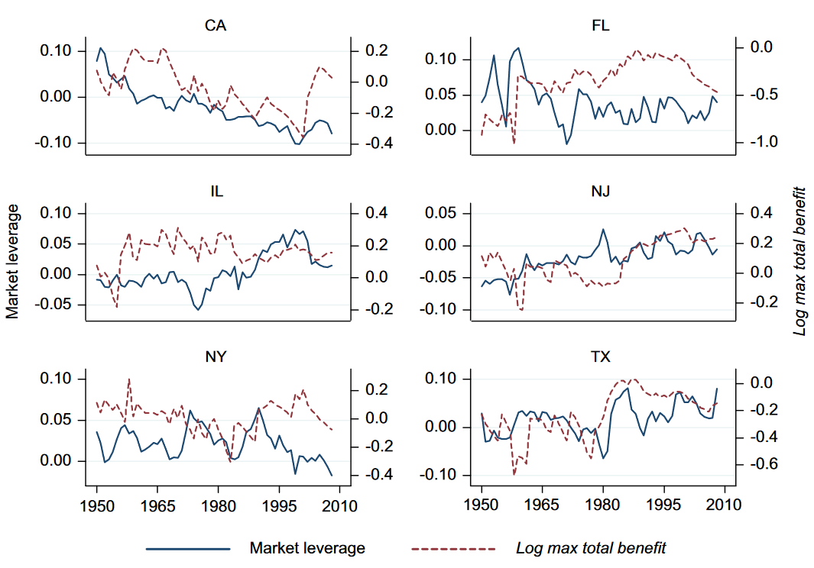

```{r setup, include=FALSE}
knitr::opts_chunk$set(echo = FALSE)
```

## Introduction


### Unemployment Risk

- Workers face adverse consequences from unemployment
- Workers require a higher premium to take on more unemployment risk
- Firms can factor in this cost and manage it
- Hard to measure
- Hard to disentangle from other financial policy considerations

## Introduction
### Background Theory

- Workers facing unemployment risk require higher wages, additional benefits, improved working conditions 
- Firms must compensate ex ante for workers to bear these risks
- Compensation increases with risks

## Introduction
### Background Theory

- Compensation demanded by workers facing unemployment risk should affect firms' financing policy
- More debt gives greater probability of financial distress
- Higher financial distress expands worker's exposure to unemployment risk
- Then, raising leverage will raise worker's "premium"

_NPV[Debt Issue] = NPV[Tax Shield] + NPV[Cost of Financial Distress] + $\Delta$ Labor Expense_

## Introduction
### Contribution and Hypothesis


- Because of labor frictions, the cost of debt becomes higher. _Because debt financing increases the probability of layoffs in distress, it raises the compensation that workers require today to bear increased unemployment risk_. \


- Provides novel empirical evidence that worker unemployment risk significantly impacts firms' corporate financial policies


### Contribution and Hypothesis


### __Hypothesis:__ 
Firms choose conservative financial policies partly as a means of mitigating worker exposure to unemployment risk


## Design

- Overcome challenge of measuring unemployment risk by exploiting changes in unemployment laws
- More generous state unemployment benefits make layoffs less costly and reduce workers' demand for compensation

###Prediction
_Increasing generosity of state unemployment benefits lead to higher firm leverage and lower interest coverage ratios_

## Design
### Unemployment Benefits

- Use state unemployment benfits to identify impact of shock to unemployment risk on financial policy
- Must assume that residual variation of UI benefits, after sufficient controls, is uncorrelated with unobservable covariates affecting corporate leverage.


## Design
### Tests

(1) Show relation between UI generosity and leverage is strong for firms whose workers face greater expected unemployment costs
(2) Show relation between UI generosity and firms with tight financing
(3) Examine timing of leverage changes to pin a causal link
(4) Look at bordering states to test economic conditions
(5) Look at other mechanisms: firm UI cost and unions


## Institutional Background

- Each state has autonomy in UI benefits
    - Can select eligibility, wage benefit amounts, duration
- Variation stems largely from maximum bounds and duration
- Economic conditions also contribute to variation
- Political forces also contribute
- Managers may be more willing to layoff worers in times of generous UI


## Institutional Background
### Meaningful Shock

Then, changes in unemployment benefits make for a meaningful shock to the cost of layoff of workers. Heterogeneity across states helps. Additionally, variation in unemployment insurance laws helps to make a clean setting to look at relation between financial policy and workers exposure to risk. 


## Data 




## Data

- Collect data on stat UI benefit laws and firm balance sheet characterisitcs
- UI benefits from Dept of Labor 1950 - 2008
- Generosity is measured as maximum benefit amount and duration alllowed

## Data

- Variation between max benefits is high (\$6000 in MS to \$28,000 in MA)
- At some point all states experience changes in state UI benefits over sample period
- States typically increase benefits from 25% to 75%
- No indication that states change laws affecting corporate debt capacity with UI laws
- Correlation between tax rate and log max total benefit is not significant. 


## Data

- Compustat
- All firms (except financial and utilities) from 1950 -2008
- Non-missing Observations
- 14,000 firms and 140,000 firm years
- Winsorized at 1% tails

## Method

- Use a Panel Regression

$$\frac{DEBT_{ist}}{VALUE_{ist}} = \alpha_1LN(MAX\_UI\_BENEFIT)_{st-1}+X_{ist}\beta + \nu_i + \omega_t + \varepsilon_{ist}$$

where $i$ is firm in state $j$ at time $t$. 

### Variables

- $X_{it}$ is set of controls
- $\nu_i$ is firm fixed effects
- $\omega_t$ is year fixed effects

Controls include proportion of fixed assets, M/B ratio, log of sales, probability of banktrupcy, ROA, state unemployment rate, state GDP. 

- Standard errors corrected for clustering at state level

## Results

- 100 log point increase in total benefits result in 4.5% greater average market leverage (1) 
- Accounting for firms whose headquarters and high percentage of workers are in different states gives $\alpha = 5.7 (3) 
- Still significant controlling for firm characteristics and macroeconomic conditions (4) and (2) 
- Significant across first differences (5) 
- Significant when excluding outlier observations
## Results


## Results

- Panel B shows book leverage, which have consistent results across the models with market leverage. They are slightly less, suggesting firms actively optimize. 

- Panel C employes interest coverage (ratio of operating earnings before depreciation to interest expense) which measure a firm's ability to use currect profits to cover interest payments of debt. 
    - Helps capture debt use of growing firms
    - Higher UI benefits imply lower interest coverage ratios (more debt)
- 100 log point increase in max UI benefit suggest 15% lower interest coverage. 


##


