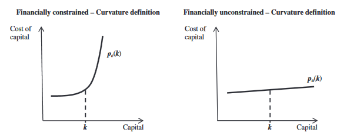
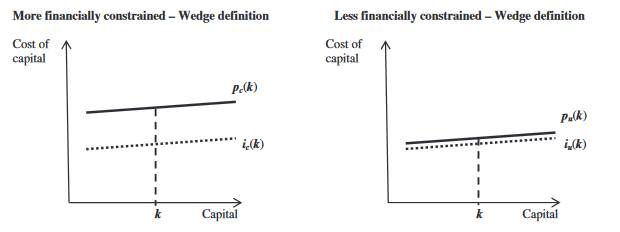
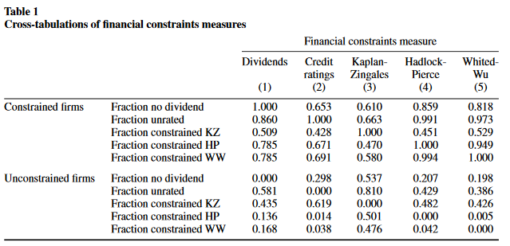
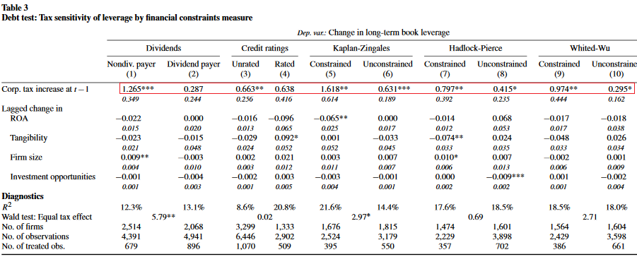
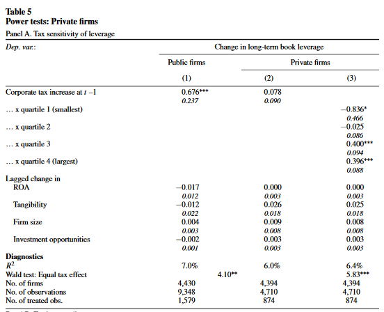
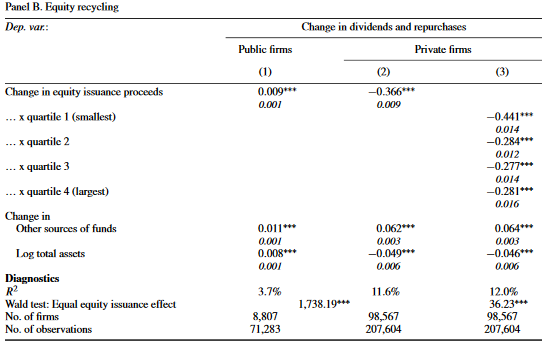

```{r setup, include=FALSE}
knitr::opts_chunk$set(echo = FALSE)
```


## Introduction

### Question

How well do traditional measures of financial constraints do their job?

### Measures

(1) No Dividend
(2) No Credit Rating
(3) Kaplan and Zingales: Index of cash flow, M/B, Leverage, Dividends, and Cash holdings
(4) Hadlock and Pierce: Update KZ - Index of size, size$^2$ and age
(5) Whited and Wu: Index of shadow price of raising equity on variety of variables


## Introduction

### Claim

None of these measures effectively identify plausibly constrained firms

### Method

- Exploit changes in state tax rates as an exogenous shock on firms demand for outside financing (tax shield) 
- Look at equity issues as well to further clarify access to outside financing


## Introduction

### Results

- A firm classified by literature as constrained does not behave in ways suggesting they are constrained
- Robust to out of sample testing with private firms and public firms close to default


## Constraints


There are two ways to define financial constraints:

(1) Curvature of Capital Supply Curve
(2) Wedge between the internal and external costs of funds


## Constraints

### Definition

__Curvature__: A firm is financially constrained if it faces a highly inelastic capital supply curve and so is unable to raise capital at any price when it tries to do so

- Let $p(k)$ be a function capturing the price at which a firm with $k$ units of capital can raise an incremental unit of capital in the capital markets. 


## Constraints

\


## Constraints

### Definition

__Wedge__: 

- Cost of new debt and equity may differ substantially from the opportunity cost of internal finance generated through cash flow and retained earnings
- A constrained firm only has access to external capital at a price higher than the price that would reflect actual risk, i.e., opportunity cost of capital


That is to say, a larger wedge implies it is costlier to issue external funding than it is to use internal funding, given the alternative potential uses of those internal funds.


## Constraints


\


## Hypothesis

### Debt

(1) A firm facing a highly inelastic supply of debt should be unable to significantly increase its leverage in response to a tax increase. 
(2) The greater the wedge between a firms internal and external costs of debt, the more value the firm transfers to debtholders when issuing debt so the less debt it should raise in response to a given tax increase, all else equal

### Equity

(1) A firm facing inelastic supply of equity should never engage in equity recycling 
(2) The tendency to recycle equity should decrease in the size of the wedge between its internal and external costs of equity


## Data 

- All public US firms traded on NYSE, Amex, or NASDAQ
- 1989 through 2011
- Filter out financial firms, utilities, public-sector entities, non-US firms, OTC/Pink sheets, firm-years with negative or missing total assets/return on assets
- 91,487 firms years for 10,112 firms

### Question

Given these firms, how well do the five classification methods yield the same results?


## Data 

\


## Data

### Important Summary Statistics of Table 2

"Constrained" firms are broadly classified by metrics (except KZ) as:

(1) Smaller
(2) Younger
(3) Less profitable
(4) Less levered

Then, being constrained does not appear to impede fast growth, R&D, or investment

KZ index suggests no size or age difference, holding less cash, more tangible assets, higher leverage, lower M/B, lower growth in sales/employment, and more investment in fixed assets


## Debt Test

### Idea

- Trade-off theory suggests firm's demand for debt should increase in its marginal tax rate
- If taxes increase, the average public firm ought to increase its long-term leverage


### Treatment/Exogenous Shock

Authors use increases in state corporate income tax rates as exogenous shocks to a firm's demand for debt
- Demand shifts would allow estimate of elasticity and relative location of debt supply curve faced by classified "constrained" and "unconstrained" firms. 


## Debt Test

### Data

- Heider and Ljungqvist (2015)
- 43 increases in corporate tax rate across 24 states from 1989 to 2011
- Look at how these exogenous changes in leverage affect firm capital structure
- Find that average public firm increases its long-term leverage in response to a corporate incrom tax increase in headquarter state


## Debt Test

### External Validity

_Are tax-induced debt issues more representative of hard-to-fund or easy-to-fund projects?_

- If they are "easier to fund" - lower rates - then results may not be generalizable to "harder to fund" projects for financially constrained companies

- Authors find interest rates 10% higher on debt-for-equity swaps than on loans
- Additionally, firm's weighted average interest rate increases by 50% for tax-related debt issues vs non-tax debt issues


Then, if firms classified as "constrained" have no trouble raising debt in tax increases, they shouldn't be financially constrained for other things either


## Debt Test

### Curvature Definition

$H_1:$ Firms classified as constrained by the five measures are unable to increase leverage in response to a tax increase


### Wedge Definition

$H_2:$ The net tax benefit defined as the difference between the value of the tax shield and the cost to shareholders of issuing debt decreases in the firm's wedge, all else equal - _The greater the wedge, the less new debt the firm should issue in response to a tax_


## Debt Test

### Identifying Assumptions

Do state tax increases trigger just an increase in demand for credit, or also an increase in supply?

- Could happen if tax increases were met with a bank tax cut and business cycle
    - Not in this data
- Another concern is that higher taxes mean less investment
    - Also does not appear to be a link between state-level tax changes and investment
    


## Debt Test

### Two more issues leading to bias:

(1) "Unconstrained" firms are more geographically dispersed than "constrained". Geographically closer constrained firms will have greater exposure to tax increase in headquarter state. This biases in favor of the null. 

    - Addressed by "good" data


(2) "Constrained" firms tend to have lower marginal tax rates. Lower marginal tax rates will give less incentive to take part in tax shield - makes it harder to conclude "constrained" or "unconstrained" firms have insignificantly different wedge. 

    - Exclude firm-years with zero marginal tax rate
    


## Debt Test

__Empirical Specification:__

$$\Delta D_{ijt} = \beta T^+_{it-1} + \delta \Delta X_{it-1} + \alpha_{jt} + \varepsilon_{ijt}$$

- $i$ firms, $j$ industries, and $t$ fiscal years
- $D$ is long term book leverage
- $X$ includes ROA, tangibility, firm size, proxy for investment opportunities
- Main variable of interest is $T^+$, the weighted average of all tax increases that have taken place in the sates in which firm $i$ operates, using $50/50$ average of the fractions of the firm's total employment and sales in a state to approximate the firm's tax nexus.


## Debt Test

__Empirical Specification:__

- Restrict Sample to firms headquartered in states with a tax increase and their immediate neighbors with no tax changes. 
- Constraining these treated and control neighbors minimizes impact of unobserved differences in local economic conditions. 


## Debt Test

### Results

- Supply Curves must be flat
- Average "Constrained" firm hit with a tax rise increases its leverage between 66 and 162 basis points
- For wedge, it appears firms increase their leverage more who are "constrained", suggesting that they have greater access to debt


## Debt Test


\


## Equity Test

### Definition

__Equity Recycling__ is the practice of raising cash from the equity market only to pay it out again to shareholders

- This indicates that a firm does not face an inelastic supply of equity curve, so should not be "constrained" according to curvature definition

- For wedge definition, "constrained" firm may find it beneficial to do so, but one would expect that equity recycling should decrease in the size of the firm's wedge
    - The larger the wedge, the less of equity issuance proceeds should be paid out
    
    
    
    
## Equity Test


### Validity

What if firms faced a flat equity supply curve given intention of raising equity for recycling?

- Would not be a problem here since firms rarely disclose this intention
- Market is more negative when firms disclose their intention to recycle equity, but not statistically so

No evidence that firms face a flatter equity supply curve when issuing equity to fund payouts


## Equity Test

__Empirical Specification__:

$$\Delta Payout_{ijt} = \beta \Delta EquityIssue_{ijt} $$
$$+ \delta \Delta Other Sources of Funds_{ijt} + \gamma \Delta Size_{ijt} + \alpha_{jt} + \varepsilon_{ijt}$$

- _Payout_ is sum of dividends and share repurchases
- _Equity Issue_ captures a firm's proceeds from firm-initiated equity issues
- _Other Sources_ is operating cash flow, debt issues net of debt repurchases, proceeds of stock options and sales


## Equity Test- Results

- "Constrained" Firms do engage in equity recycling
- "Constrained" Firms recycle no less than "unconstrained"


## Equity Test - Results


\


## Equity Test

### Dividends

- Notice dividends are included in both "dividends" and KZ classifier, and regressor loads heavy on that factor. Dividends are a part of total payouts. 
- To avoid potential error, leave out dividends from depended variable 
- Results are the same (just a bit smaller)


## Equity Test

### Endogeneity

- No exogenous tax change in this test
- Maybe formerly constrained firms started using equity recycling while constrained to access equity market
    - Forward looking measures in Table 4 categorizing firm in year $t+1$ uphold base results
- Results are still the same as initial test


## Robustness - (Small) Privately held firms

\


## Robustness - (Small) Privately held firms

\


## Robustness - Firms Close to Default

- These firms should be financially constrained
- Firms with high probability of default have statistically insignificant increase in leverage when tax hike occurs. 
- Firms with high probability of default do not engage in equity recycling


## What do Financial Constraints Measure?

### Findings

- Authors look at frequency with which public firms raise equity, sell bonds, and take out loan
- "Constrained" firms are more likely to fund themselves with equity
- "Constrained" firms rarely issue bonds
- "Constrained" firms use syndicated loan market (private loans)

It appears that these measures identify smaller, younger, and faster growing firms, not necessarily constrained firms


## Conclusion

- Authors use test that exploit exogenous shocks to the demand for debt and firm's tendency to recycle proceeds of equity issues to increase shareholder payout
- None of the five measures can identify firms that behave as if they were constrained
- "Constrained" firms can raise debt and equity just as easily
- Caution is needed when interpreting results based on traditional measures
