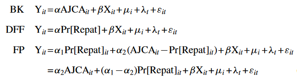
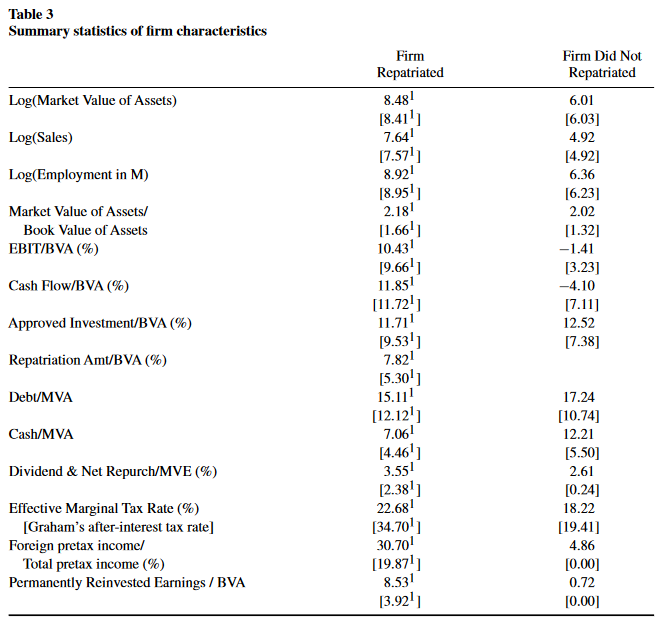
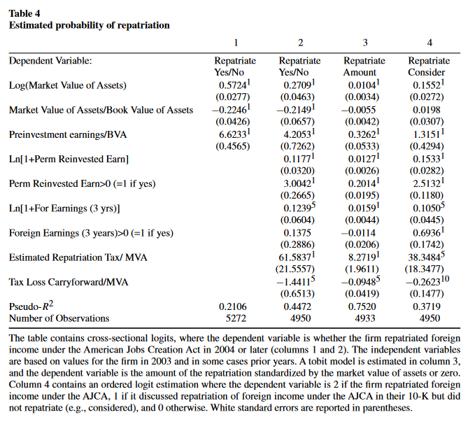
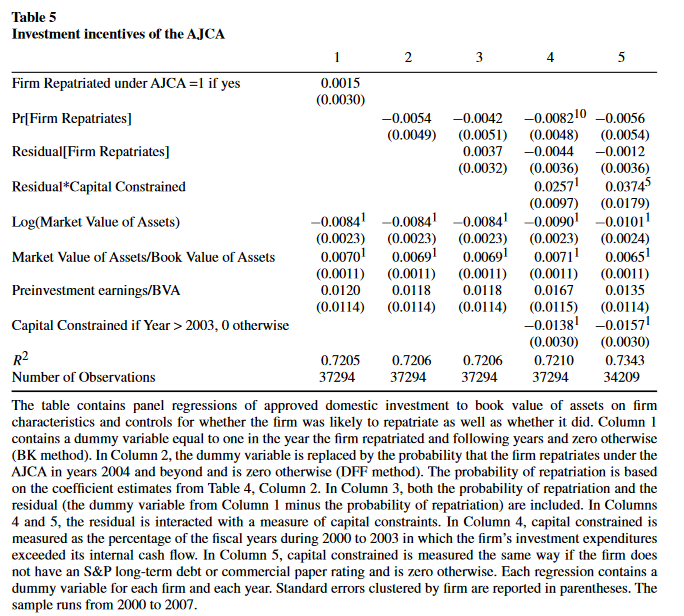

```{r setup, include=FALSE}
knitr::opts_chunk$set(echo = FALSE)
```


## Introduction

### Two Big Questions

(1) To what extent do financing frictions constrain investments that firms would otherwise make?
(2) Did firm that repatriated under the American Jobs Creation Act significantly increase their domestic investment?


## Previous Literature

### DFF

Dharmapala, Foley, and Forbes (2011), "Watch What I Do, Not What I Say: The Unintended Consequences of the Homeland Investment Act" _JF_. 

### BK

Blouin and Krull (2009), "Bringing it Home: A Study of the Incentives Surrounding the Repatriation of Foreign Earnings Under the American Jobs Creation Act of 2004" _JAR_.


## Previous Literature

### Findings

- Examine Use of Funds repatriated under the AJCA
- Find no increase in investment due to repatriation
- Repatriated Funds were used to increase payments to shareholders
- However they both employ two different research designs


## Introduction

In contrast, Faulkender and Petersen find:

- AJA led to large increases in investment among subset of firms that are capital constrained
- Experimental design of former authors did not isolate constrained firms properly
    


## Background

- American Jobs Creation Act (AJCA) signed into law in 2004 by President George W Bush
- Encouraged domestic investment by lowering the tax costs of repatriating income US firms had sitting abroad
- Firms have an incentive to keep cash abroad 
    - The longer the deferral, the lower the present value of the tax to bring cash home
    - This assumes investment opportunities are same in both countries and no capital market imperfections
- But, what if we relax the above assumption?


## Background

### Do the incentives align?

- In a world without financial frictions, firms will invest in all positive NPV projects
- If US has domestic high NPV projects, firms will repatriate, use domestic internal funds, or capital markets
- With financial frictions, the cheapest method wins
- Then, the AJCA assumes by design that firms are financially constrained, having no domestic internal funds or access to capital markets


## Background

There are three firms:

(1) Firms with little or no foreign earnings in low-tax jurisdictions 
(2) Firms that repatriate foreign income under AJCA and are constrained 
(3) Firms that repatriate foreign income under AJCA and not constrained 


## Empirical Musings


- Prior work by BK and DFF use a DID where sample of firms is divided into treated and untreated group controlling for firm characteristics
- But, there are THREE groups!
- Difference between findings here and previous work lies in this idea


## Empirical Musings

### Demonstration

- Group 1: Firms with no tax-advantage in foreign earnings, do not increase response variable
- Group 2: Firms with tax-advantaged foreign earnings increase response variable with repatriation
- Group 3: Firms with tax-advantaged foreign earnings increase response variable without repatriation


## What's the Difference?

### BK

- Run a standard DID by including dummy variable which is equal to 1 in year firm repatriates and zero otherwise
- Coefficient then measures increase in response variable for firms that do not repatriate (Group 3) versus the increase in response variable for firms that do not repatriate (Group 1 and 2)

## What's the Difference?

### BK

- Cannot know if effect is due to:
    - Repatriation (comparison of group 3 to group 2)
    - Or due to differences between firms with and without foreign earnings in low-tax jurisdictions (difference between group 1 and both group 2 and 3)

 - Because first group (in BK) has higher increase in investment than the second group, coefficient on AJCA dummy is positive, even when there is no effect    
    
_$DID_{BK}$ = Diff[Group 3] - Diff[Group 1 and 2]_


## What's the Difference?

### DFF

- Use instrumental variable approach
    - IV: firm's foreign tax rate is lower than US and whether firm's foreign subsidiaries are in tax havens
- Replaces AJCA dummy in BK with probability that firm repatriates
- Firms wih unrepatriated income in low-tax countries have high probability of repatriation


## What's the Difference?

### DFF

Coefficient measures the increase in the response variable for firms with high probability of repatriation (Groups 2 and 3) independent of whether they actually repatriate income versus the increase in the response variable for firms with low probability of repatriation (Group 1)

_$DID_{DFF}$ = Diff[Group 2 and 3] - Diff[Group 1]_


- Estimating the coefficient this way will make it larger and positive than BK finding even if effect is zero


## Analogy

### That's sick bro!

- Group 1
    - People that are healthy
- Group 2 and 3
    - People that are sick
- Group 3
    - Sick people given a treatment
    
-If you wanted to evaluate the performance of a treatment, you would not compare change in helath of those who received the treatment (3) to those who did not (1 and 2) - as BK do. 

- You would not compare the change in the health of those that were predicted to receive the treatment (the sick 2 and 3) to those who are unlikely to receive the treatment (1). This is approach of DFF.


## Empirics

### Goal

Conditional on being able to tae advantage of the tax subsidy on repatriation in the AJCA, do firms invest ore or increase equity payouts if they repatriated under the AJCA. 

- Three groups $\implies$ two coefficients, not 1, in DID

\


## Data

- Collect AJCA data from firms' 10-ks
- Searched using Perl script for AJCA from 2004 - 2006
    - 804 that discussed repatriation, did not repatriate
    - 442 firms repatriated income ($298 billion repatriated)
    - Remaining sample of firms from this period did not disclose
- Need to measure both firm's current and recent history of foreign profits, and stock of foreign profits that are classified as permanently reinvested abroad


## Characterisitcs of firms that repatriated income under the AJCA

\


## Characterisitcs of firms that repatriated income under the AJCA

\


## Empirical Analysis


(1) Examine which firm characterisitcs are associated with likelihood of repatriating under AJCA
    - Estimate cross-sectional model of who repatriates using M/B, size, preinvestment profitability
(2) Use these variables to predict whether firms repatriate or not
(3) Use second set of variabels to measure firm's stock of unrepatriated earnings
    - log of one plus firm's permanently reinvested foreign earnings - use dummy = 1 if greater than zero. 
(4) Measure tax benefit of repatriation 
    - compare taxes that would have been paid on the foreign income had it been taxed in US at 35% to the actual foreign taxes paid. Scale by market value of assets
    
    


## Empirical Analysis

\


## Empirical Analysis

\


