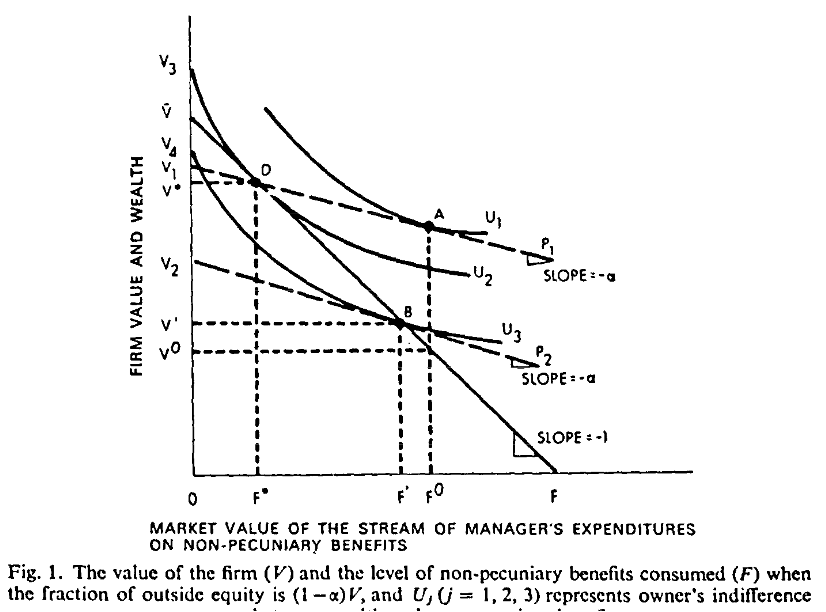
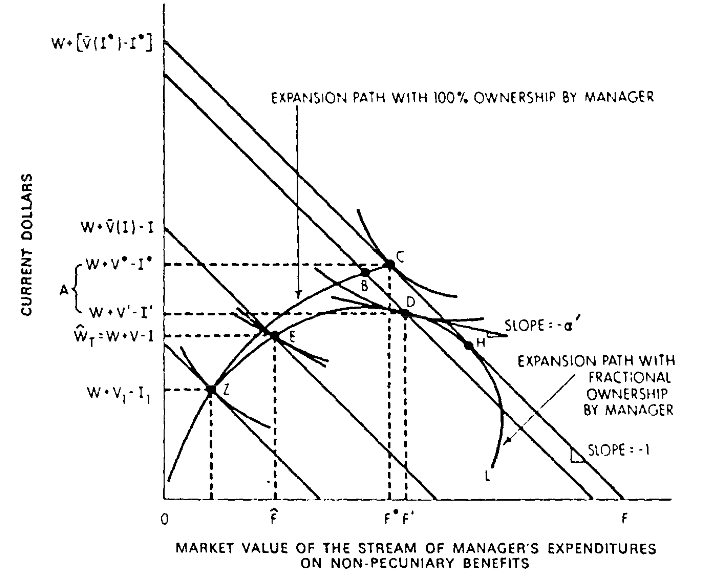
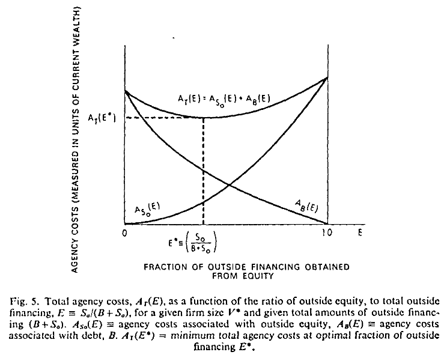

```{r setup, include=FALSE}
knitr::opts_chunk$set(echo = FALSE)
```

## Introduction

+ Before Jensen-Meckling, agency was not a topic broadly considered in theory of firm literature

+ Other Economic models considered

+ Where agency was considered, it was a normative project (prescriptive and not descriptive)

## Agency Costs

+ Relationship as a contract to delegate from one person (principal) to another person (agent) decision making authority

+ Both principle and agent are utility maximizers, so interests will not always align (i.e., agent does not act in best interest of principal who gave him authority)

+ Like a market, a firm will have an equilibrium between principal and agent

The cost to align these interests and create incentives for agent to act in line with principal define _agency costs_:

(1) Monitoring expenditures by principal
(2) Bonding expenditures by agent
(3) Residual Loss

## Big Idea

+ Incentives of manager can greatly change depending on if he is the sole owner or issues outside equity

+ The manager seeks to maximize his utility, constrained by the trade-offs competing goods of firm-value and "perquisites" or perks

+ Manager incurs agency costs from issuance of equity due to his consumption of perks

+ Financing with debt allows manager to retain greater ownership, but also creates incentives for manager to invest in risky projects at expense of bondholders. Consequently, he will also incur those agency costs of debt too.


+ Optimal Capital Structure will be one that minimizes total agency costs


## Agency Costs and Outside Equity

+ Assume one period of time (no dynamic modeling) and one "owner-manager"
+ When a manager owns 100% of firm, he has a dollar-for-dollar trade-off of firm value and perks
+ Sells some portion $(1-\alpha)$ of firm, retains $\alpha$, then, trading off firm value for perks is only $\alpha < 1$
+ Then, he can maximize his utility with perks included at the expense of other equity holders
+ Potential Buyers of equity should, under rational expectations, should be aware that the manager may not act in their best interest - purchase price of shares should reflect this:

_Theorem: For a claim on the firm of $(1-\alpha)$ the outsider will pay only $(1-\alpha)$ times the value he expects the firm to have given the induced change in the firm behavior_


## Agency Costs and Outside Equity




## Agency Costs and Outside Equity

+ When mananger owns 100% of firm, he consumes optimal amount of non-pecuniary benefits $F^*$ together with optimal firm value $V^*$ denoted $D$ on budget line $\bar{V}F$. 

+ Manager gives up $(1-\alpha)$ of firm. If buyer believes manager will consume NP benefits as he did before, the buyer will be out of luck

+ Manager can acheive higher utility now that his trade-off between firm value and NP benefits has gone from dollar to dollar to dollar to $\alpha \times$dollar - he consumes at $A$, and firm value falls from $V^*$ to $V^0$ at outsider's expense.

+ With rational expectations, buyer will know that manager will consume more NP Benefits at his expense, and so manager's new trade-off follows line $V2P2$, a lower value associated with a lower preference set. Then, we see $B$ corresponding to new optimal amount $F'$ of NP benefits and $V'$ of firm value


## Agency Costs and Outside Equity

_Theorem: For a claim on the firm of $(1-\alpha)$ the outsider will pay only $(1-\alpha)$ times the value he expects the firm to have given the induced change in the firm behavior_

Wealth of Manager represented by $W = S_0 + S_i = S_0 + \alpha V(F, \alpha)$ or selling price of $(1-\alpha)$ of the firm to outsiders plus value of his $\alpha$ portion given consumption of $F$ dollars in perks.

If owner who sells $(1- \alpha)$ of the firm takes less than the optimal "equilibrium" non-pecuniary benefits, then he is making an irrational decision since he sold the $(1- \alpha)$ share for less than he could have. 

+ $(1- \alpha) V' > S_0$ where $S_0$ is price of $(1-\alpha) V'$ sold to outside owner


Similarly, if he consumes more than the optimal amount of non-pecuniary benefits, it devalues the firm and the outside owner paid more than what the firm is worth. 

+ $(1 - \alpha) V(F, \alpha) < S_0 = (1 - \alpha) V'$ where $V(F, \alpha)$ is value of non-pecuniary benefits consumed


## Agency Costs and Outside Equity

+ Outsiders will not pay their share of the full value of the firm since the manager can potentially lower the value of the firm for his gain on perks

+ Then, outsiders will pay for a smaller value, factoring in the perks the manager will claim

+ Consequently, the decline in total value of the firm from its original amount to what the outside equity holders paid for it will be imposed by the manager


## Agency Costs, Equity, and Determining Optimal Scale


+ In a similar demonstration, Jensen and Meckling show that wealth is lost through agency costs when investment is considered as well. 

+ For the sole owner-manager, there will be an equilibrium between firm value and perks which maximizes his utility considering if he could fund all investments on his own

+ Outside financing incurs agency costs as the owner-manager seeks maximize both firm value and consumption of non-pecuniary benefits. 

_Thus the manager stops increasing the size of the firm when the gross increment in value is just offset by the incremental "loss" involved in the consumption of additonal fringe benefits due to his declining fractional interest in the firm._


## Agency Costs, Equity, and Determining Optimal Scale





## Monitoring and Bonding

(1) Monitoring: Firm's outside owners could monitor manager activities, forcing him to give up some use of non-pecuniary benefits through a contract. 
    + Owner manager will do so only if the increase in value of the firm is better for him than the forgone benefits
    + Less benefits mean more firm value less the montoring costs
    + Owner bears cost as wealth reduction
    
(2) Bonding: Manager-owner can spend resources to guarantee to outsiders that he would limit his costly activities
    + Manager will only do it for same reason as accepting monitoring costs and would be same loss


When investment is considered, the story is the same: manager will give up rights if he desires, and the value of the firm will be the equilibrium value less the investment and monitoring/bonding costs. 

## Summary of Agency Cost of Outside Equity

+ As manager gives up ownership, his incentives and those of outsider owners change
+ He will still seek to partake of non-pecuniary benefits which results in lost value of the firm
+ To curb this, outsiders will pay less, or they will ensure monitoring or accept bonding activities
+ In either case, such losses are unavoidable and borne by the decision maker (owner-manager)
+ Then, owner-manager will only do it if the pros outweight the cons

Next, look at debt

## Debt

MM can imply that, given tax advantages of debt, firms should be financed 100% with debt all else being equal.

No firm has 100% debt in reality because:

(1) Incentives of manager
(2) Cost of monitoring incentives
(3) Bankruptcy costs

Debt is still optimal for manager even if no tax benefit due to incentives alone


Like the equity case, there will still be monitoring and bonding costs associated with debt


## Debt - Issues with Incentives

+ Manager can use debt to invest in risky project, reaping rewards of high returns while passing cost onto debtholders

+ Like equity, debtholders should be aware and set expectations accordingly - thus they will pass onto managers less debt than they would have otherwise had available. 

+ Then, this agency cost of debt due to asset substitution is incurred by manager who issues debt

Saw numerical example in previous class (Asset substitution on slide 65)


##Debt - Bonding Costs and Monitoring Costs

+ Monitoring given by bond covenants
    + Cannot be too detailed (costly)
    + Bondholders will need to weigh accordingly marginal benefit given marginal cost of enforcing and adding covenant

+ Manager has interest to see that monitoring is performed in lowest cost way since debt and covenants eat into market value of firm

+ If manager can do a better job policing himself, it can pay him in advance to incur his own monitoring costs - or rather bonding

+ Bankruptcy similar to arguments above - manager incurs cost as market accurately prices securities given potential of bankruptcy

##Debt Benefits

+ Manager inherits all negative wealth effects of debt and should be better off by reducing debt

+ But, tax subsidy on interest payments may entice

+ JM argue that debt should still be valued without tax benefits. 
    + Could be the case manager cannot raise equity and debt is the only option to capture positive NPV project
    + He will incur agency costs of debt so as long as the marginal cost of doing so is not greater than the marginal wealth gained from issuing debt


## Theory of the Corporate Ownership Structure

Say Corporate Ownership structure instead of Capital Structure to point out one does not only consider ratio of debt to equity, but also the amount of equity owned by manager as well

Assume: 

(1) Assume efficient capital markets and prices of debt and outside equity reflect monitoring costs. 
(2) Owner-manager bears these costs

Then:

_From the owner-manager's standpoint the optimal proportion of outside funds to be obtained from equity (versus debt) for a given level of internal equity is that [optimal fraction of equity to debt plus equity] which results in minimum total agency costs._ 


## Theory of the Corporate Ownership Structure

+ Manager desires optimal fraction of financing to come from equity: $E^* = S^*_0 / (B + S_0)$
+ Function $A_{S_0}(E)$ is total agency costs associated with exploitation of the outside equity holders
    + Increases as Equity increases (highest when $E^* = 1$)
+ Function $A_{B}(E)$ is total agency costs associated with debt in ownership structure. 
    + Decreases as Equity increases (highest when $E^* = 0$)


+ Then, total agency costs $A_T(E) = A_{S_0}(E) + A_{B}(E)$
+ Consequenty, optimal capital structure will be determined by weighing trade-offs of agency costs of debt and equity. 
+ Increasing outside financing increases agency costs in both respects
    + Larger the firm, larger then agency costs
+ Optimal scale of outside financing will be when marginal agency costs equate the manager's own demand for outside financing (diversification)


## Theory of the Corporate Ownership Structure




