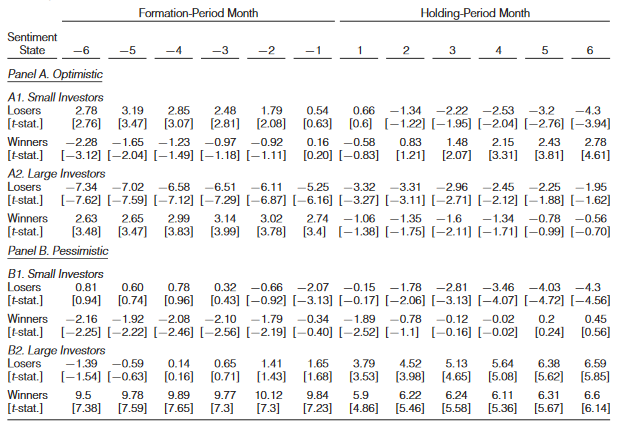

```{r setup, include=FALSE, fig.align='center'}
knitr::opts_chunk$set(echo = FALSE)
```


## Introduction

__Key Question__: Do variations in profitability from momentum stem from variations in sentiment?


## Introduction

### Definition

__Sentiment__ refers to whether an individual, for whatever extraneous reason, feels excessively optimistic or pessimistic about a situation. 

### Definition

__Newswatchers__ documented by Hong and Stein (1999) are different groups who react to news, creating a slow dispersion of news and thus momentum. 


## Introduction

### Hypothesis

- Newswatchers will underreact more strongly whent they receive information that contradicts their sentiment due to cognitive dissonance.
- This implies bad (good) news among (loser) winner stocks will diffuse slowly when sentiment is optimistic (pessimistic). 
- This will lead to momentum, driven by the loser portfolio in optimistic sentiment periods and the winner portfolio in pessimistic sentiment periods. 


## Introduction

### Main Results

- Strong momentum in optimistic periods controlloing for market returns, analyst coverage, size, and CAPM/FF
- No momentum in pessimistic periods
- Small investors are slow to sell losers during the optimistic periods in intraday transactions
- Momentum profits reverse significantly after optimistics periods (but not in pessimistic periods)


## Previous Work

- Hong and Stein (1999): Newswatchers react to news and create momentum
- Cooper, Guitierrez, Hameed (2004): investor biases more accentuated after gains - momentum profits follow only market increases
- Chordia and Shivakumar (2002): Momentum profits are significant only in expanding economy
- Livnat and Petrovic (2008): investor sentiment linked to post-earnings announcement drift
    - Others also show fund flows, value effect, corporate disclosure, IPO, size effect
    
    

## Data

- All common stocks of NYSE and AMEX from 1967 to 2008
- Construct momentum portfolios using method of Jegadeesh and Titman (1993)
    - Each month $t$ sort stocks based on returns of past $J$ months, create 10 portfolios
    - Winners at the top, losers on the bottom
    - Each month, hold winner portfolio and short loser portfolio, holding for $K$ months
    - Portfolios are overlapping, close position in month $t-K$ and take new position using winners and losers of month $t$
    - As is standard, allow 1 month between end of the formation period and beginning of holding period
- Delete all stocks less than \$1


## Data

### Investor Sentiment Measure

- Monthly time series of consumer confidence sentiment constructed by the Conference Board (CB). 
- Begins in 1967 for bimonthly measures, and 1977 has monthly measures
- Sent to 5000 randomly selected households in United States
- Asks 5 questions about outlook for the economy
- Sum favorable replies, divided by total replies


## Data

### Investor Sentiment Measure

- Purge Macroeconomics by regressing index on:
    - growth in industrial production
    - real growth in durable ocnsumption
    - nondurable consumption
    - services consumption
    - growth in employment
    - NBER recession indicator
- Take residuals and use them as the sentiment proxy


## Data

### Investor Sentiment Measure

For discovering optimism/pessimism:

- caluclate weighted-rolling average of the setiment level for the 3 motnhs prior to the end of the formation period
- give weight of 3 to sentiment in prior mornth, 2 to the one in month prior to that, and 1 beyond that
- Classify as optimistic (pessimistic) if the 3-month rollowing average ending in month $t$ belongs in the top (bottom) 30% of the 3-month rolling average in the time series


## Empirical Analysis

### Hypothesis

Negative (positive) information about stocks when sentiment is optimistic (pessimistic) will conflict with investors' prior beliefs and cause cognitive dissonance. 


## Empirical Analysis

### First Test

- Examine profitability of the momentum stratedgy conditioning on pessimistic and optimistic investor sentiment states
- Look at strateegies based on $J = 6$ month ranking period and holding periods of $K =  3,6,12$ months sorted by investor sentiment


### Result

- Average monthly profits in optimistic periods are higly signficant, decrease as optimism decreases
- Higher momentum profits in optimistic periods arise because loser stocks continue to underperform in subsequent periods
    - bad news diffuses slowly when investors are optimistic - cognitive dissonance
- Profits significant in "mild" sentiment months supported by prior studies - greater optimism than probability implies


## Empirical Analysis

\


## Empirical Analysis

Consitent with Cooper et al. (2004) consider market states

### Design

- Classify each formation period into UP or DOWN market states independent of investor sentiment
    - CRSP value-weighted index return for 36, 24, and 12 month period
- Derive momentum profits for optimistic and pessimistic periods during UP and DOWN markets

## Results

- Most (87.2%) significant momentum profits occur in UP markets
- Momentum strategies in DOWN markets


## Empircal Analysis

### Table 3 UP states

\


## Empircal Analysis

### Table 3 DOWN states

\


## Empirical Analysis

### Model

$$PROFITS = b_0 + b_1SENTIMENT + b_2MARKET + b_3 MARKET^2 + u$$

Where:

- $PROFITS$ is the time series of average monthly MOM profits at $t$
- $MARKET$ is lagged market return of the value-weighted index incluyding divedends

### Results

- Momentum Profits increase with the market return but decrease with the squared market term (nonlinear - supports Cooper et al (2013)).
- Sentiment predicts momentum profits independently of market returns


## Empirical Analysis

### Table 4

\


## Empirical Analysis

### Analyst Coverage

- Previous research suggests momentum is stronger for stocks with low analyst coverage
- Using IBES, get 1-year-ahead earnings per share forecasts as proxy for analyst coverage
- Isolate role of analyst following size by regressing log one plus ANALYSTS = a + b*SIZE + e 
    - get ranked residuals and separate in three equal weighted portfolios 
    - Makes low-, mid-, and high-residual coverage stocks. 
    
### Results

- Difference in momentum profits between optimistic and pessimistic perdios is simlare across all groups
- Retain insignificance in pessimistic periods


## Empirical Analysis

### Table 5

\


## Empirical Analysis

### Size

- Previous Research shows that return predictability is stronger for smaller companies

### Method

- Separate firms into small and large market capitalization using Kenneth French's size breakpoints

### Result

- Momentum is generally larger for smaller compaines
- Sentiment is more dramatic in smaller compaines (probably diffuses more slowly


## Empirical Analysis

### Is it Risk?

- Are higher/lower returns of the winner/loser portfolio during periods of optimism load more/less strongly on economic risk factors?

### Method

- Use CAPM, FF, and Conditional CAPM
- Perform risk adjustment to get risk-adjusted profits

$$r_{kt}^{ADJ} = r_{kt} - \sum_t \beta_{ik} f_{it}$$


## Empirical Analysis


### Is it Risk? - Method

- Also use a CCAPM robustness check, allow covariance between returns of mom portfolios with excess market return to vary with investor sentiment:

$$r_{kt}^{ADJ} = r_{kt} - (\beta_{ik} - \beta_{ik}^{SENT} \times SENTIMENT_{t-j})(R_m - R_f)$$

-  $r_{kt}$ is the raw returns of each MOM portfolio for the strategy in the holding period month $K$ in month $t$
-  $\beta_{ik}$ is the estimated factor lading in month $K$ on excess the market return
-  $\beta_{ik}^{SENT}$ is the factor laoding in month $K$ on the interaction between excess market return and investor sentiment


## Empirical Analysis

### Table 7

\


## Empirical Analysis

### Controlling for future macro events with VIX and one period ahead macro variables

\


## Empirical Analysis

### An Alternate Sentiment Index

Following Baker and Wurgler (2006, 2007):
  - Make time series of six sentiment proxies:
      (1) Trading Volume
      (2) Premium for dividend-paying stocks
      (3) Closed-End Fund Discount
      (4) Number of IPOs
      (5) Mean 1st-day IPO Returns
      (6) Equity share in new issues
      
  - Regress against macro variables. Take residuals from each.
  - Take first principle component of residuals
  
  
## Emprical Analysis

### Table 9

\


## Cognitive Dissonance, Short Sale Constraints, and Momentum Profits

Authors have shown that momentum is stronger in optimistic sentiment periods, driven by continued underperformance in loser portfolio. \\


They claim cognitive dissonance toward negative news during optimistic period is the cause

### Left to Show

(1) Examine market's response to negative earnings surprises for loser stocks, conditional on sentiment
(2) Short-selling constraints a part of the reason that congnitive dissonance subsists
(3) Effect of smaller vs big investors
(4) Reversion in the long-run


## Congnitive Dissonance and Momentum Profits

### Method

- Identify winners and losers, based on 6-month cumulative returns
- Look at SUE for month $t+1$
- Rank firms in deciles based on SUE, calculate cumulative returns in impact and adjustment

### Result

- Short-term absolute reaction for negative earnings during optimistic periods is highre than that for pessimistic ones
- Post-earnings announcement drift after negative surpries is stronger when sentiment is optimistic


## Congnitive Dissonance and Momentum Profits

### Table 10

\


## Short-Selling Constraints on Momentum

### Table 11

\


## Investor Size

- Categorize small and large investor net OIB (order imbalances) using intraday data


### Result

- small investor order flow for loser portfolio during optimistic periods is positive and signficant in 5 of 6 months in formation period
    - turns negative in holding period
- Supports idea that unsophisticated investors are slow to sell losers during optimistic periods, prolonging pricing of bad news


## Investor Size

### Table 12

\


## Investor Size

- Authors calculate avewrage daily OIB for large and small investors following strong negative earnings surprises
- Selling pressure during event period for small investors is stronger when sentiment is pessimistic (not statistically significant)
- Small investors exert delayed selling pressure in adjustment period, suggesting cognitive dissonance
- Large investors sell losers with bad news four times more heave when sentiment is optimistic


## Investor Size 

### Table 13

\


## Reversals

### Table 14

\


