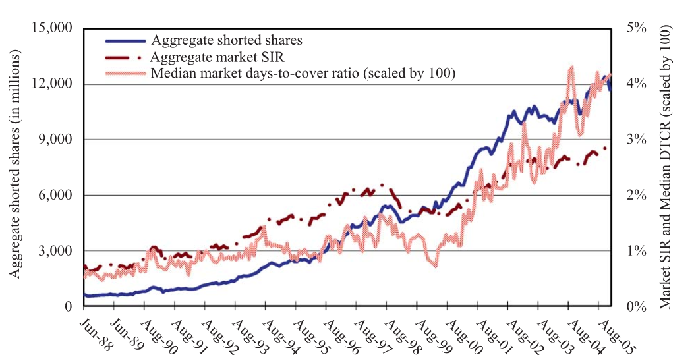
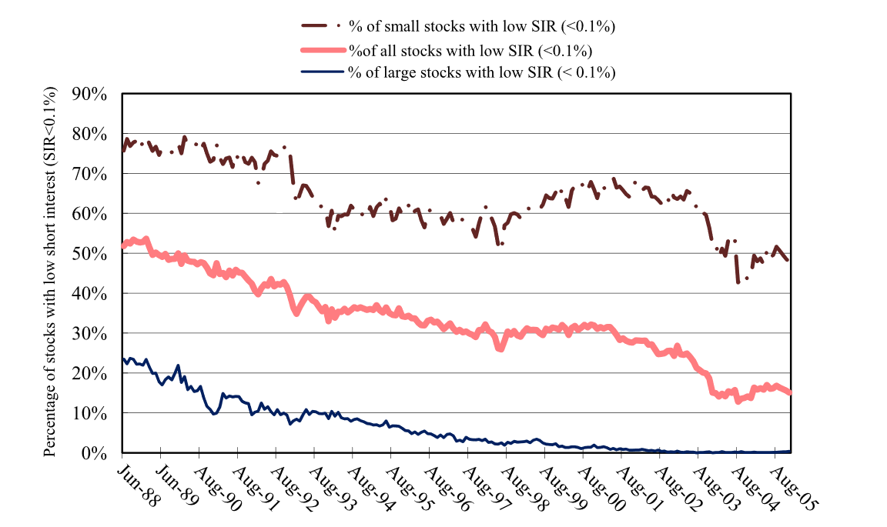
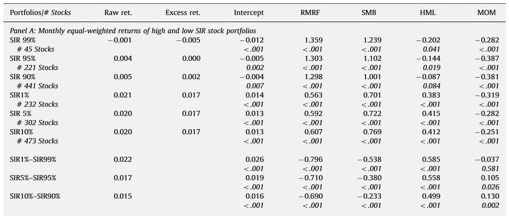
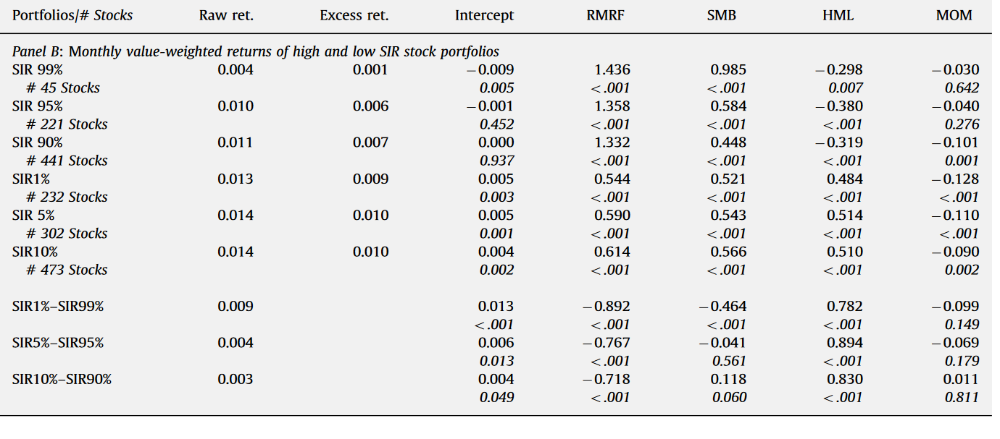
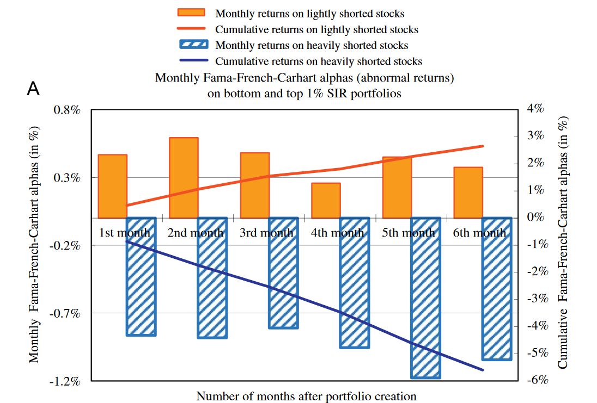
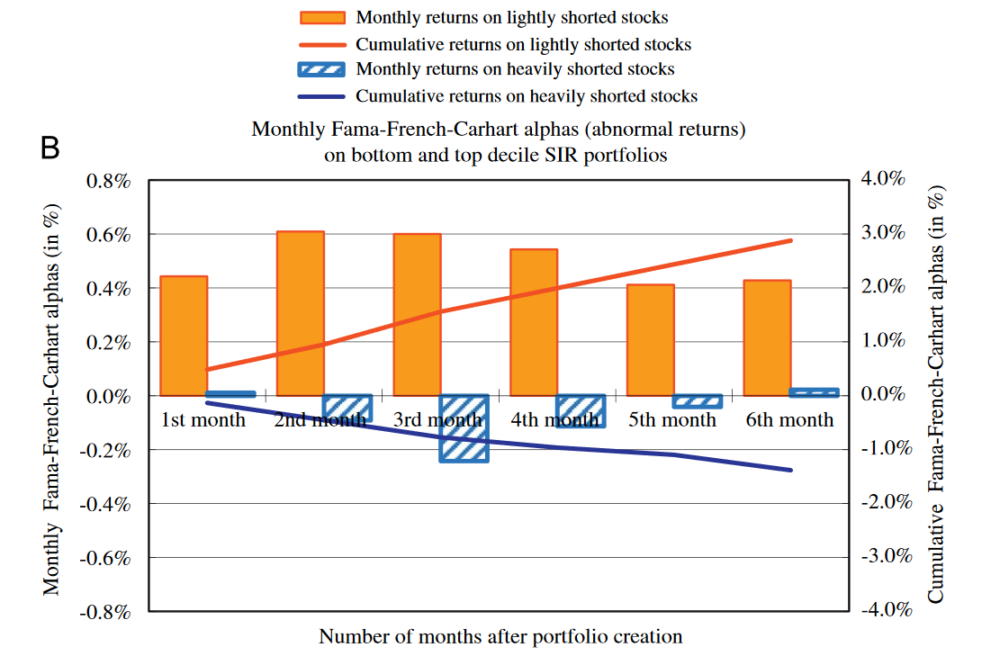
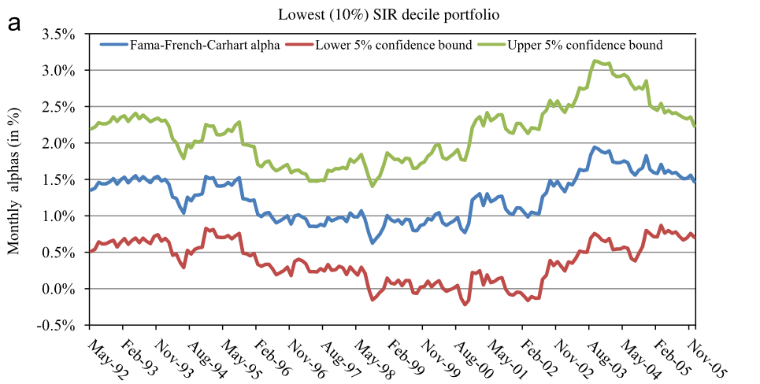
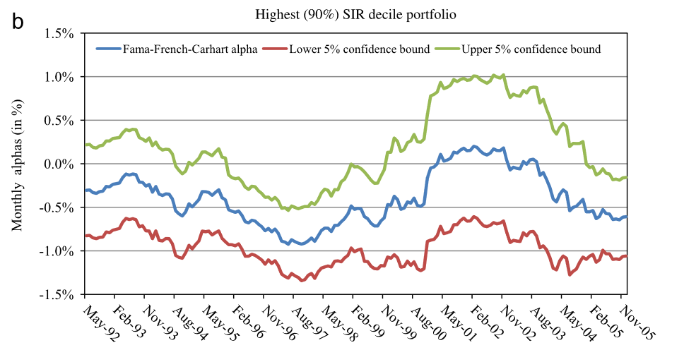
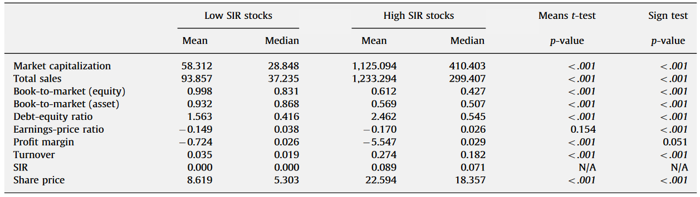

```{r setup, include=FALSE}
knitr::opts_chunk$set(echo = FALSE)
```

## Introduction

### Question

Is the _absense_ of short selling informative about future returns?


## Introduction

### Overview

- Portfolios of lightly shorted stocks have large and significant abnormal returns
- Both bad and _good_ news known to short sellers are not incorporated into prices
- Short sellers can identify overvalued stocks and can adequately avoid undervalued stocks


## Background

- Short sale constraints can inhibit bad news being incorporated into prices
- Miller (1977) - Stock prices too high on average because of over optimism
- Hong and Stein (2003) - short sale constraints can promote market crashes
- Diamond and Verrecchia (1987) - rational investors know negative info is withheld, account for bad news
- Desai et al. (1995), Senchack and Starks (1993) - High SIR stocks underperform


## Background


### Previous focus

- Negative information and short selling


### Contribution

- What about lightly shorted stocks?
- Is it true that short selling is highly constrained for these stocks?
- Or are short sellers actively avoiding these stocks?
    - If no constraints, perhaps low shorting makes for good news
    

## Data 

### Short Interest Ratio

- Monthly snapshot of percentage of shares outstanding sold short 
    - Some contradictory claims regarding SIR
    - Many studies affirm high SIR is associated with negative returns and under performance
- Data from June 1988 to December 2005 on NYSE, Amex, and Nasdaq


## Data

### Other
- CRSP monthly returns, trading volumes, shares outstanding and end-of-month prices
- Compustat financial information from annual industrial files
- Common stock, listed for at least one year


## Data

- Exclude data with missing monthly returns, trading volume, shares outstanding, or EOM prices
- 930,109 stock-month obs
- 634,583 from Nasdaq
- 285,541 from NYSE
- 9,985 from Amex
- Avg of 4,400 firms per month

## Data

### SIR Measures

(1) Aggregate number of shorted shares
(2) Aggregate short interest ratio (aggregate shorting as percentage of total shares outstanding)
(3) Median days-to-cover ratio (SIR divided by share turnover)


## Data




## Data 




## Method

- Test for abnormal returns during calendar month following WSJ publications of SIR data
- Create portfolios of lightly and heavily shorted stocks
    - 99th, 95th, 90th, 10th, 5th, 1st percentiles for SIR
- Use Fama-French-Carhart Four Factor model to test for abnormal returns for portfolios
- Use both equal and value weighted portfolios


## Baseline Results 

### Notable Results

- Large, significant positive abnormal returns for lightly shorted stock portfolio
- Lightly shorted portfolio contains small cap value stocks
- Long/short portfolio has positive returns and negative beta
- Equal weighted has stronger results than value weighted portfolio


## Baseline Results 




## Baseline Results 




## Baseline Results





## Baseline Results





## NYSE-Amex vs Nasdaq

- Nasdaq-only returns similar to baseline due to size
- NYSE-Amex sample has smaller returns
    - Not all abnormal returns are significant

- Stocks more heavily shorted in smaller NYSE portfolio
- But, results are more attributed to trading activity and firm size then venue


## NYSE-Amex vs Nasdaq 

### Details

- NYSE-Amex Equal Weighted
    - Lightly shorted stocks have sig. positive excess returns 0.4% per month for SIR 5% and 10%
    - SIR 1% is not significant
    - 1% minus 99% is significant with 2.1% excess return and beta -0.659
- NYSE-Amex Value Weighted
    - Not significant 
    - Long/short portfolio still has significant return, with beta -0.682


## Subperiod Results

- Returns do not appear period specific with 48 month rolling returns
- Rolling betas appear quite stable as well
    - Heavy shorted stocks 1.2 to 1.4 with tight standard errors
    - Lightly shorted stocks 0.4 to 0.8 with tight standard errors
- Dividing into two subperiods give similar results to one whole period

 
## Subperiod Results





## Subperiod Results





## Sorts on Firm Characteristics

- High SIR stocks have larger market caps
- High SIR stocks have higher prices
- High SIR stocks have lower B/M ratios
- High SIR stocks have lower median earnings yields and median profit margins
- High SIR stocks have weaker fundamentals, and are more heavily traded

Does this imply that size and liquidity are driving results?


## Sorts on Firm Characteristics




## Sorts on Firm Characteristics

Concerning size, breakpoints in construction of SMB may be of issue. All smaller Nasdaq stocks ended up in a single portfolio

### Joint Effects of Size and Trading

- Construct size and trading intensity with 4x4x4 sort on:
    (1) Size
    (2) Turnover
    (3) SIR
    

## Sorts on Firm Characteristics

### Process

(1) Look at entire sample
(2) Leave out Nasdaq
(3) Leave out NYSE-Amex


## Results

For three smaller size quartiles:
 
- Large abnormal returns for low SIR stocks in higher turnover groups
- returns in low SIR and larger than returns on high SIR portfolios across all turnover quantiles

For large size quartile:

- weaker results across the board, but still significant results
- portfolio with long high turnover, low SIR, and short high turnover, high SIR has 1.9% monthly return


## Results

For NYSE only stocks, results are much the same

- long/short portfolio with high turnover has 2.6% monthly abnormal return
- Significant negative abnormal returns in highly shorted stocks are outside largest quartile


Overall, results most pronounced in smaller stocks


## Results

For Nasdaq only stocks:

- Most shorted portfolios tend not to have significant abnormal returns
- Least shorted portfolios have significant positive returns for all but one portfolio
    - Smallest, highest turnover have highest returns
    
## Results

- For low SIR stocks, high turnover is important
- Also, smaller firms is important - Venue does not appear to matter


## Robustness

- Nasdaq bubble period of 1998 - 2000
    - Exclude cheap stocks and dates 1998 - 2000
    - large, positive abnormal returns for low SIR, high turnover stocks 
- Optionable Stocks
    - Stocks without options more difficult to short
    - Low short interest could be a function of constraints
    - Eliminating stocks with options still gives consistent results (eliminates large firms)


## Robustness

- Lagging
    - smaller results in some value-weighting, but still significant
    
- Momentum
    - Divide winners from losers, sharpens results especially for low SIR
    


## Robustness

- Positive information in low short interest stock could precede the short interest
- Look at large decrease in short interest (25%) across three months for each stock
- Level of short interest is persistent
- Conclusions unaffected by excluding stocks with larger changes in SIR


## Summary and Extensions

- Short sellers can not only identify overvalued stocks but undervalued ones too
- Stocks are highly traded (high turnover) despite being small, so constraints don't appear problematic
- Does the act of focusing on losers necessarily bring the ability to identify winners? 
    - Why don't short sellers arbitrage this away? 
- Repeat study with longer time period, Recession included


