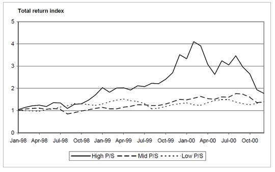
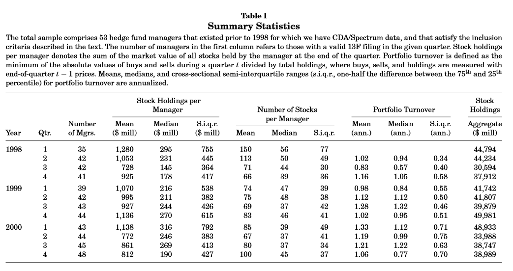
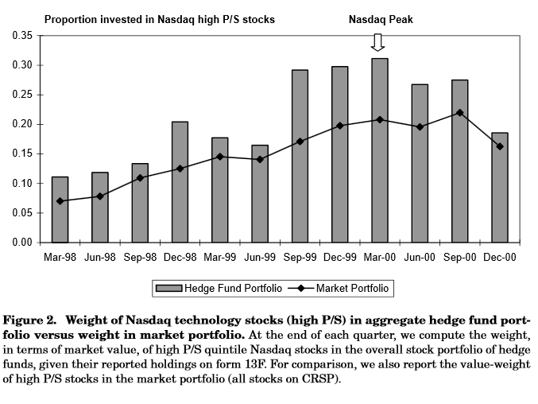
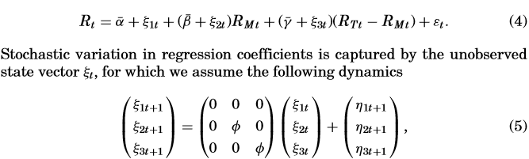
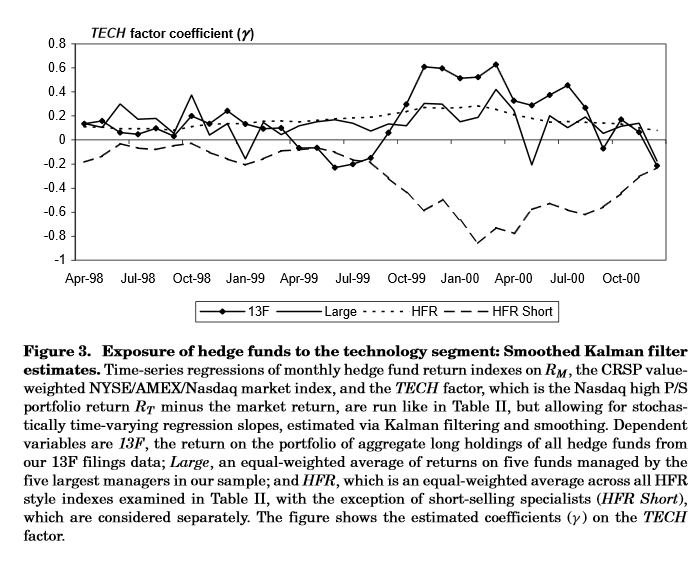

```{r setup, include=FALSE}
knitr::opts_chunk$set(echo = FALSE)
```


## Introduction


### Underlying Theory

Different views:

- Stock prices increase when driven by irrational investor euphoria (Shiller 2000)
- Efficient Market Hypothesis argues rational investors will exploit mispricing and correct it
- Limits to Arbitrage suggest noise traders, agency problems, and synchronization risk may constrain arbitrageurs to correct mispricing. 
- Rational investors ride the bubbles for a while and have destabalizing effect


## Introduction

### Overview

- Find whether sophisticated speculators help correct Technology bubble
- Look directly at hedge fund holdings
- Hedge Funds anticipated price peak, captured upturn, and avoided downturn
- No evidence hedge funds exerted correcting force on prices
- Does not appear aversion to arbitrage risk and frictions explain why funds didn't correct


## Data 

## Defining the Bubble Segment

- Look for stocks that were most likely to be overvalued during bubble
    - Use price to sales ratio
- Use monthly stock returns from 1998 to 2000
- Sort stocks into quintiles based on highest P/S ratio

## Data 

## Defining the Bubble Segment

\


## Data

### Hedge Fund Holdings

- Spectrum Database by Thomson Financial
    - Based on 13F filings with SEC
    - Track positions in individual stocks at a quarterly frequency
- Use hedge fund returns to back out short positions indirectly
- Identify Hedge Funds using _Money Manager Directory_
- Look up each manager by name in Thomson
    - 71 managers
    
    


## Data

### Hedge Fund Holdings

- Reporting entity is institution, not the fund
- Check firm status as investment advisor with SEC
    - Signals non-hedge status: exclude
- In Form ADV, require 50% of clientes are:
    - Other pooled investment vehicles
    - high net worth individuals
- Cuts managers down to 53


## Data
\


## Data

### Important Note

- Hedge Funds in this sample hold 0.3% of outstanding equity
- Dwarfed by other institutional investors
- Then, this paper is NOT looking at causal links between hedge fund holdings and price changes. 
- Interest is in trading behavior of "rational" investors in a bubble


## Did Hedge Funds Trade against the Bubble?

\


## Did Hedge Funds Trade against the Bubble?

Could preferential IPO allocations explain?

- Investors given shares of "hot" IPO's on first day of trading and selling them after (flipping)
- In exchange, Investment Bank increases trading commissions
- Could not see clearly in data
- Separating newly listed items on CRSP in data do not appear to deviate from overall analysis


## Return Regressions

Look at two asset classes: market portfolio return $R_m$ and portfolio of technology stock returns $R_T$. Manager will allocate $b$ fraction of portfolio to the market and reallocate $g$ of total portfolio value from market to technology stocks. Let $R_t$ be:


$$R_t = (b-g)R_{Mt} + g R_{Tt} + e_t$$


## Return Regressions

Now, want to look at ratio of hedge fund lonng and short positions compared with the market. The net investment in techonology stocks as a proportion of the total portfolio is $(b-g)m_T + g$ and the net invesment in stocks overall is $b$. Then, the ratio is: 


$$w_T = m_T + \frac{g}{b}(1 - m_T)$$
Long only fund means $b=1$ and $g=0$. Need to recover $b$ and $g$ and do so in the following regression:


## Return Regressions

$$w_T = m_T + \frac{g}{b}(1 - m_T)$$
Long only fund means $b=1$ and $g=0$. Need to recover $b$ and $g$ and do so in the following regression:

$$R_t = \alpha + \beta R_{Mt} + \gamma (R_{Tt} - R_{Mt}) + \epsilon_t$$

with $\beta = b$ and $\gamma = g$


Call $(R_{Tt} - R_{Mt})$ the $TECH$ factor. 


## Return Regressions

- Run regression over monthly returns in sample period
- Returns net-of-fees.

### Three Samples:

(1) Five largest managers in terms of stock holdings - $Large$
(2) Hedge fund style indexes with significant exposure to equity
(3) Monthly return series on long-only copycat fund - 13f


## Return Regressions


\


## Return Regressions

### Results

- Panel A shows largest hedge fund managers had positive exposure to $TECH$
    - Higher than Figure 2 (20% there vs 49% here) due to shorting
- Panel B SHort-selling specialists are only ones to have negative $TECH$
- Panel C reveals overweighted exposure is not limited to fifth P/S quintile

In short, accounting for short positions strengthens results - hedge funds offset market exposure, not technology exposure


## Return Regressions

Previous modeling yielding average exposure over the sample. Would be interesting to look at model with time-varying coeffecients: 

### Kalman Filter

\


## Return Regressions

\


## Portfolio Holdings of Individual Manager Fund Flows


