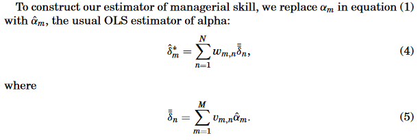
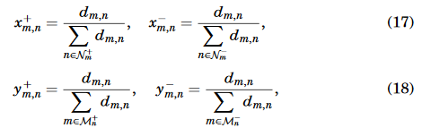
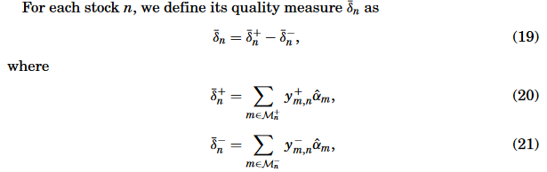
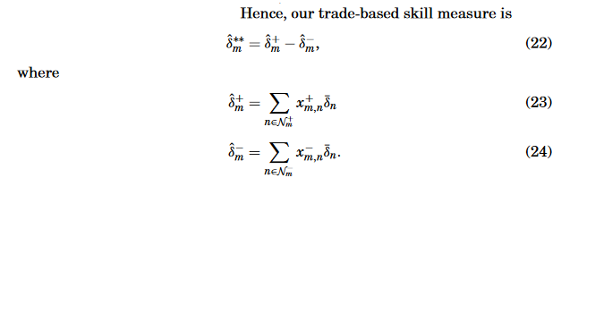
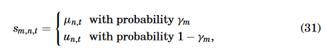
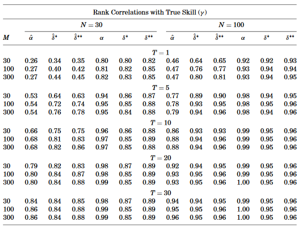

```{r setup, include=FALSE, fig.cap=''}
knitr::opts_chunk$set(echo = FALSE)
```


## Introduction 

### Intuition

- Active Mutual Fund managers rely on many techniques to reach benchmarks
- Managers using similar techniques more likely to make similar decisions
- Then, managers who make similar investment decisions should deliver similar performance


## Introduction

### Signs

- Can tell if manager is skilled by comparing investment decisions with other skilled managers given private info
- Skilled managers make similar investment decisions because they interpret info well (if public)
- Similar managers should have similar portfolio compositions


## Introduction

### Intuition for novel measures

- This paper's metric of a manger's skill is a weighted average of traditional skill measures across all managers where weights are covariances between the manager's current portfolio weights and the current weights of the other managers
- Trade-based performance judges manager's skill by extent to which recent changes in his hoilding match those of managers with outstanding past performance. 
    - weighted avg of traditional skill measures, but weights are covariance between concurrent changes in manager's portfolio weights and those of other managers
- Evaluate mutual fund performance by pooling information across funds - instead of single history for single manager


## Introduction

### Simulations

- Results come by way of simulations:
    - estimators produce higher rank correlations with true skill than standard estimators
    - estimators perform best with high number of managers, small history
    


## Introduction

### Fund Return Predictability

- Sort funds in deciles according to both alpha and novel measures
- Find fund returns have persistence after controlling for momentum
- Authors show that their measures contain significant information not found in alpha


## New Performance Measures

### Two Measures

(1) Measure Based on Levels of Holdings
(2) Measure Based on Changes in Holdings


Equation (1) 
$$\bar \delta_n = \sum_{m=1}^M v_{m,n} \alpha_m$$
Equation (2) 

$$v_{m,n} = \frac{w_{m,n}}{\sum^M_{m=1} w_{m,n}}$$
for:

- $M$ managers and $N$ stocks which is held by at least one manager. 
- $\alpha_m$ denotes reference measure of skill for manager $m$ - here Jensen's alpha
- $w_{m,n}$ is weight of stock $n$ in manager $m$'s portfolio.
Then, we call $\bar \delta_n$ the quality measure. 


## Measure Based on Levels of Holdings

### Intuition

Equation (1) and (2) say the quality of stock $n$ is the average skil of all managers who hold stock $n$ in their portfolios, weighted by how much stock they hold. 

- Implies that skilled managers hold more high quality stocks


From this we get Equation (3), the population performance measure:

$$\delta^*_m = \sum^N_{n=1} w_{m,n} \bar \delta_n$$

which measures manager's performance as the average quality of all stocks in manager's portfolio, where each stock contributes to its portfolio weight. 


## Measure Based on Levels of Holdings


\


## Measure Based on Levels of Holdings


- Some derivations via matrix algebra show that a manager's skill is a weighed average of the usual skill measures across all managers. The weight assigned to the performance of a manager is simply simiply a loose measure of covariance between the weights of one manager with another. 

- Additionally, $\bar{\hat{\delta}}^*_m = \bar{\hat{\alpha}}_m$
    - That is, skill measure here has same info as usual measure about performance of mutual fund industry as a whole
    - There will be gains to the skill measure, however. 
    
- If $\hat\alpha_m$'s are not perfectly correlated, $\hat \delta^*_m$ has a lower standard error. 


## Measure Based on Changes in Holdings

### Intuition 

- Last measure inferred managers make similar decisions if they have similar holdings
- Now, assume managers make similar decisions if their trades are similar


## Measure Based on Changes in Holdings

Return on portfolio of manager $m$ at time $t$ can be written as:

$$R_{m,t} = \sum^N_{n=1} w_{m,n}r_{n,t}$$
where $r_{n,t}$ denotes the return on stock $n$. Change in weights is:

$$d_{m,n} = w_{m,n,t} - w_{m,n,t-1} \frac{1+r_{n,t}}{1+R_{m,t}}$$
which is the difference between the current weight and the weight obtained if the manager neither bought nor sold any of this stock over the past period (one quarter). 


## Measure Based on Changes in Holdings

- $\mathcal{N}_m^+ = \{n:d_{m,n} > 0\}$ - stocks purchased by manager $m$ between $t-1$ and $t$
- $\mathcal{N}_m^- = \{n:d_{m,n} < 0\}$ - stocks sold by manager $m$ between $t-1$ and $t$
- $\mathcal{M}_n^+ = \{m:d_{m,n} > 0\}$ - set of managers who made net purchases of stock $n$ between $t-1$ and $t$
- $\mathcal{M}_m^- = \{m:d_{m,n} < 0\}$ - set of managers who made net sales of stock $n$ between $t-1$ and $t$


## Measure Based on Changes in Holdings

\

where $d_{m,n}$ is the difference between the current weight and the weight obtained if the manager neither bought nor sold any of this stock over the past period (one quarter).

- Then, $x^+_{m,n}$ ($x^-_{m,n}$) captures the fraction of manager $m$'s purchases (sales) accounted for by stock $n$
- And, $y^+_{m,n}$ ($y^-_{m,n}$) captures the fraction of purchases (sales) of sotck $n$ accounted for by manager $m$ 


## Measure Based on Changes in Holdings


\

The quality of stock $n$ is the difference between the average skill of all managers who bought stock $n$ recently and average skill of all managers who sold stock $n$ recently, where the averages are weighted by how much was bought and sold

- Example: Stocks of high quality are those that wre recently bought mostly by high-skill managers and sold by low-skill managers

## Measure Based on Changes in Holdings


\


This is the difference between the average quality of stocks recently bought by manager $m$ and the average quality of the stocks recently sold by this manager. 


## New Performance Measures

### Some Considerations

- Not necessarily an optimized measure - would be challenging
- May look like "herding" but literature does not factor in trades
- Not just window-dressing since managers not only judged by portfolio, but also its relation to others


## Simulations

### Design

Let $M$ managers receive signals about expected excess returns of $N$ stocks:
$$r_{n,t} = \mu_{n,t} + e_{n,t}, n=1,...,N;t=1,...,T$$

where $\mu_{n,t}$ is the stocks's expected excess return and $e_{n,t}$ is an error term. Each are drawn from a normal distribution centered on zero with distinct variances. 

- In every period $t$, each manager $m$ receives a signal $s_{m,n,t}$ about each stock $n$. With probability $\gamma_m$ this signal is equal to the stock's true expected excess return, error otherwise:

\


## Simulations

### Design

Managers know their skill and error volatility. They have no information about expected excess return other than the signal. 

Then, goal will be to estimate:

(1) Traditional Estimator of $\alpha$ and $\hat \alpha$ - Jensen's alpha
(2) Performance measure based on level of holdings $\hat \delta^*_m$
(3) Performance measure based on change in holdings $\hat \delta^{**}_m$
(4) Bayesian estimator $\hat \alpha^B_m$
(5) Population values $\delta^*_m$ and $\delta^{**}_m$


## Simulations

### Process

- Conduct 10,000 simulations for each se of parameter values
- Set managers $M$ equal to 30, 100, and 300
- Set number of stocks $N$ equal to 30, 100
- Set number of time periods $T$ to 1, 5, 10, 20, and 30
- Let $\sigma_{\mu} = 0.1$ and $\sigma_e = 0.5$
- Calculate measures for each manager (on previous slide)
- Rank managers according to these measures to uncover correlation with true skill $\gamma$


## Simulations - Result
### Table 1
\


