```{r setup, include=FALSE, fig.align='center'}
knitr::opts_chunk$set(echo = FALSE)
```

## Introduction

### Key Points

- Paper documents evidence for behavioral biases among Chicago Board of Trade
- Traders in this market are highly loss-averse, assume above average risk to combat earlier losses
- This behavior has important price impact on afternoon prices
- Prices set by loss-averse traders are reversed significantly more quickly than by unbiased traderes


## Introduction


### Overview

Testing for behavior biases is hard
  - Many different behavioral theories rooted in Psychology
  - Models cannot be easily tested with aggregare data
      - Detailed data is hard to get
  - Hard to measure investor horizon 
  - Hard to distinguish from noise trading
      - Challenging to link bias impact on prices
      

## Introduction

### Setting - Chicago Board of Traders 

- Bias should show up:
    - Traders exchange $200 million worth of contracts per day
    - Traders participate in 95% of all trades
- Trades are done by market makers - with personal accounts
- Trading Horizon is clear - most traders close position every day


## Introduction

### Roadmap

(1) Look for signs of traders taking either greater or lesser risk as profits grow
(2) Split trading day and compare trading in morning and evening
(3) Examine traders to see if they are more likely to move afternoon prices following morning losses
(4) Examine permance of price moves spurred by morning losses
(5) Examine whether prices exhibit greater volatility in afternoons following morning losses


## Introduction

### Bias in Beliefs

(1) Self-Attribution (overconfidence)
(2) Conservativeness and Representativeness 


### Bias in Preferences

(1) Prospect Theory
    - Profits near zero lead to high subsequent risk aversion
    - Risk-seeking behavior present in regon of losses
(2) House-money Effect


## Hypothesis and Assumptions

__Hypothesis__: There is no relationship between morning returns and afternoon risk-taking

### Assumptions

(1) Efficient Markets
(2) Rational Traders
(3) Traders have Von Neumann-Morgenstern utility functions
(4) Negligble Wealth Effects
(5) Margin constraints unimportant
(6) Raders' compensationand reputational concerns neutral
(7) Profit opportunities are uncorrelated across trading day


## Hypothesis

### Alternative 1

Self-attribution bias, representativeness heuristic, and house money effect predict morning returns will be positively related to afternoon risk-taking


## Alternative 2

Risk-seeking in losses predicts the null will be rejected if morning returns are negatively related to afternoon risk-taking


## Data 


- CBOT T-Bond futures 1998
    - Includes identifiers for buer and seller, price, time of transaction, and on whose behalf
- 426 Traders using their own personal account. 
- To measure profit and inventory, assume each trader closes position at end of day (no beginning inventory)
    - Use inventory controls and winsorize
- Profit computed by looking at market value of inventory times contracts outstanding, added to local's running profit figure


## Data

### Measuring Risk 

- Use historical price change data, second-by-second time and sales from Future Industry Institute Data Center
- Calculate front-month futures contract prices at the beginning of each minute from 1989 to 1998
- Fit Ordered Logit Regression to get probability of various portential abs price changes over next minute
- Use fitted values to construct an expected absolute price change for each minute of each full trading day in 1998. 
- Calculate trader's risk by multiplying each minute's risk measure by the trader's position at the beginning of the mintue. 
- Adjust trader's risk for the minute by any changes in inventory (and therefore risk) in the minute 
- Calculate cumulative risk - Total Dollar Risk


## Method


- Split trading day into two periods: before 11:00 am and after
- For each trader, calculate morning and evening profits
- Also, calculat total dollar risk, number of trades and average trade size
- Normalize traders profits and risk-taking to account for heterogeneity in margin constraints


## Table 1

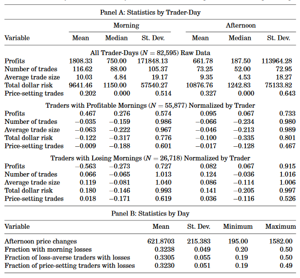\


## Morning Losses Lead to Afternoon Risk-Taking

Regress Afternon risk-taking on morning profits:

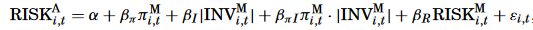\

where 

- $\pi^M_{i,t}$ is trader _i_'s data _t_ morning profit
- $\big| INV^M_{i,t} \big |$ is abs value of trader _i_'s outstanding position at the end of the morning on date $t$. 
- $RISK_{i,t}^M$ is trader $i$'s morning risk measured on date $t$

They also used Pooled Regression and Fama-MacBeth

## Results 

- A one standard deviation decrease in morning profits leads the average trader to to place more afternoon trades than normal
- Higher inventory positions midday associated with higher afternoon risk
- Traders who assume significant risk in the morning continue to do so in afternoon
- Consistent results when top N% of traders with morning losses compared to only top N% of traders with greatest morning gains

## Results - Table 2

\
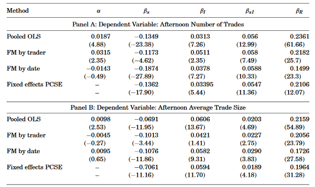\


## Results - Table 2
\
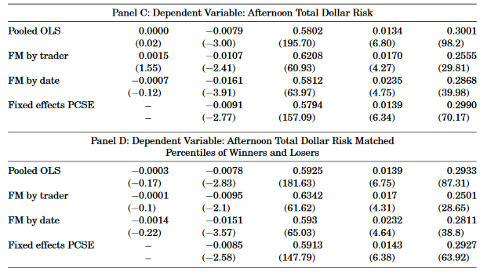\


## Results - Sorting

### Table III
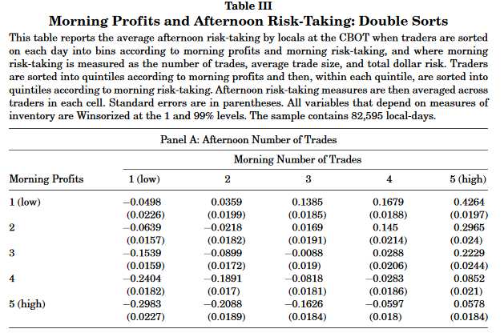\


## Results - Logit Model

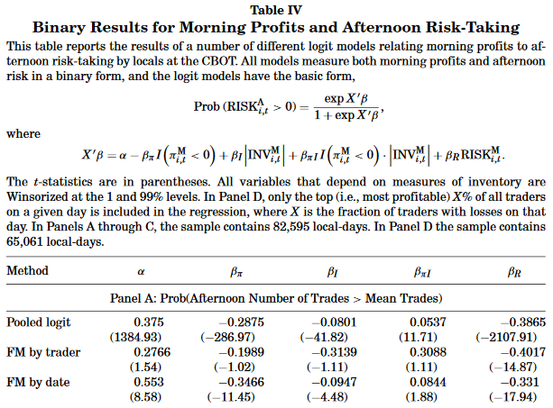\


## Results - Logit Model

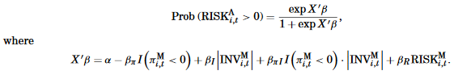\

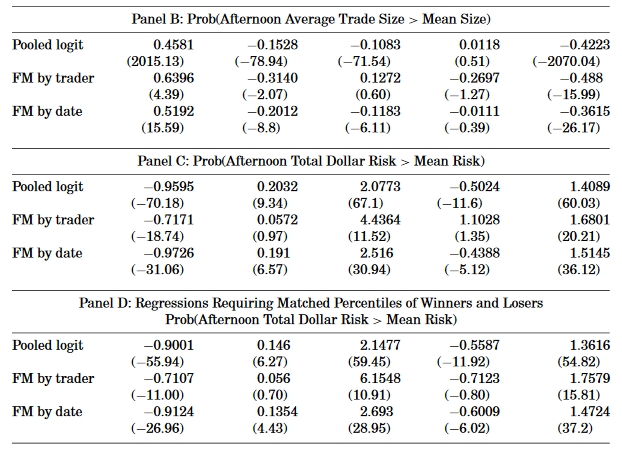\


## Semiparametric Regression

Use semi-parametic model to account for kinks:

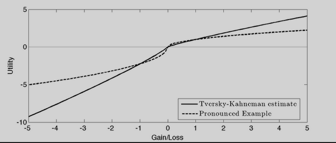\


## Setup

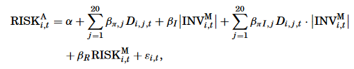

- Rank traders each day according to their normalized morning profit and assign them to one of 20 profitability groups
- Conduct daily cross-sectional regressions with model above
- Dummy variable $D$ equals one if trader $i$'s morning profit ranks in group $j$ on the date $t$. 
- Average the cross-sectional regression coefficients across time, compute standard errors


## Semiparametric Regression

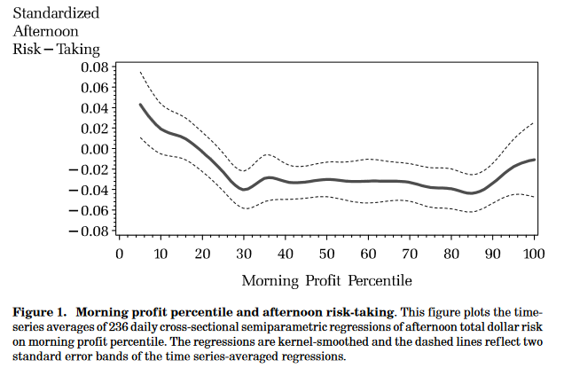

Losing trader behavior is more senstivite to the level of their losses than winning traders to the level of their gains!


