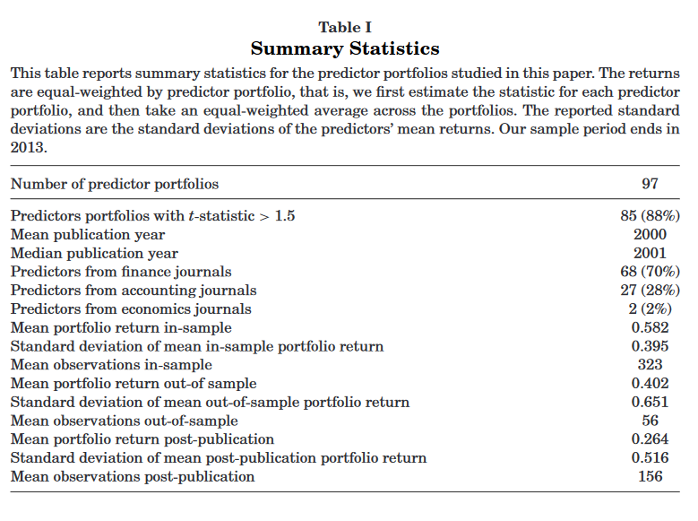
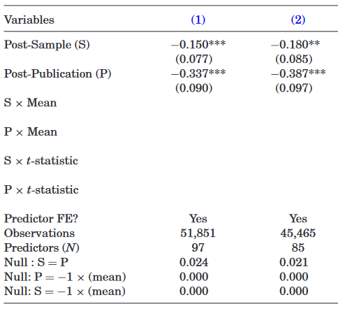
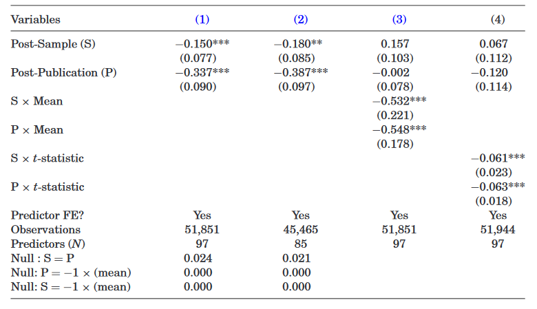
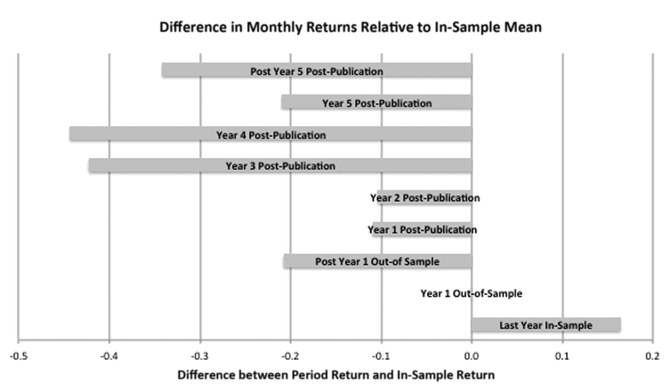
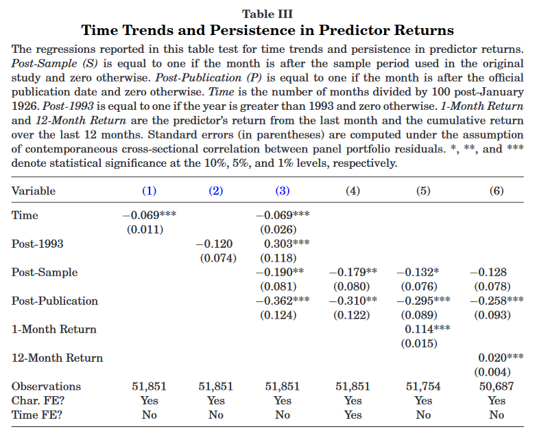
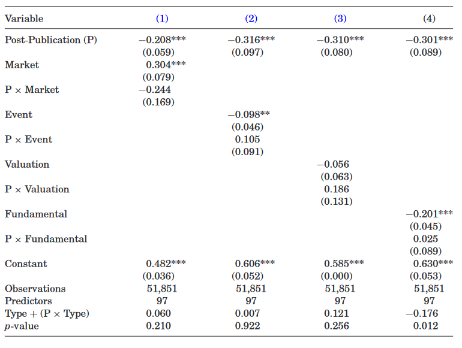
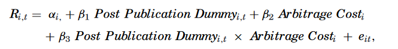
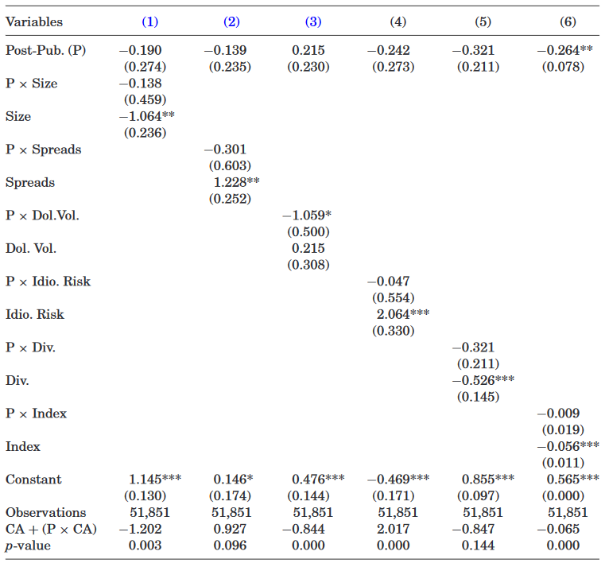
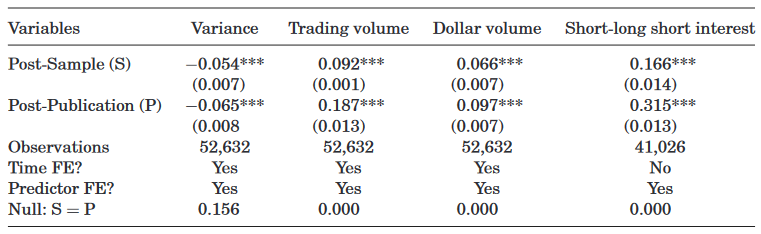

```{r setup, include=FALSE}
knitr::opts_chunk$set(echo = FALSE)
```

## Introduction

### Question

What exactly happens to return predictability outside of a study's sample period?


## Introduction

### What could happen?

(1) Perhaps the findings are spurious and only fit the partitioned sample period
(2) Or maybe there will be no change, and return predictability will persist
(3) Or return predictability will diminish post-publication, suggesting mispricing


## Introduction

### Hypotheses

(1) If findings are spurious, there should be no returns outside of the sample period
(2) If return predictability reflects rational expectations, findings should remain
(3) If return predictability is due to mispricing, then return predictability should disappear or be decay after a paper is published


## Introduction

### Key Findings

Using 97 predictors from 79 studies the average predictor long-short quintile portfolio return:

(1) Declines 26% out-of-sample 
(2) Shrinks 58% post-publication

Additionally, decay is larger for:

(3) Predictor portfolios with larger in-sample returns and higher t-statistics
(4) Predictors constructed from price and trading data


## Introduction

### Contribution

- Academic publications transmit information to sophisticated investors
- Or _we do something worthwhile and important_!


## Research Method

- Exclude time series predictability
- Focus on studies in peer-reviewed finance/economic/accounting literature


## Research Method

- Gather 97 cross-sectional relations from 79 studies
- Form long-short quintiles based on results

### Some Concerns

- Data no longer available to construct some measures - get proxies
- Rate of increase/decrease - form long-short portfolios with extreme 20 percentiles
- Dummy variables - separate into long or short side of the portfolio
- Discrete values - follow original research 


## Summary Statistics

\


## Empirical Analysis


__Baseline Regression:__

$R_{it} = \alpha_i + \beta_1$ _Post Sampe_ $Dummy_{i,t} + \beta2$ _Post Publication_ $Dummy_{i,t} + e_{it}$


### Correlation

- Overall correlation is 0.033, but some will be higher
- Compute standard errors using feasible generalized least squares (FGLS)


## Empirical Analysis

### Formal Hypotheses

(1) If statistical biases are the source of in-sample predictability, then the coefficients on both the post-sample and post-publication dummies should be -0.582
(2) If predictors' returns are entirely the result of mispricing and arbitrage resulting from publication corrects all mispricing, the the post-publication coefficient should be equal to -0.582 and the post-sample dummy should not be close to zero
(3) If there are no statistical biases and academic papers have no influence on investors' actions, then both of the coefficients should equal zero. 


## Regression of Predictor Portfolio Returns on Post-Sample and Post-Publication Indicators

### Table II

\


## Regression of Predictor Portfolio Returns on Post-Sample and Post-Publication Indicators

### Question

Do predictor portfolio returns with higher in-sample means decline more post-publication?

### Test

- Interact in-sample means with predictors
- Interaction for post sample is -0.532 and post-sample is 0.157
- Notice $0.157 + (-0.532 \times 0.582) = -0.153$ - nearly the same as column (1)
- Indicates that predictor with larger return could have larger bias
- Or could indicate arbitrageurs are more likely to learn about higher returns before publication


## Regression of Predictor Portfolio Returns on Post-Sample and Post-Publication Indicators

### Table II

\


## Result

### Figure 2

\


## Controlling for Time Trends and Persistence

### Concern

- Perhaps the authors are measuring a time trend that proxies for lower costs of corrective trading


### Control

- Use time variable that is equal to $1/100$ in January 1926 and increases by $1/100$ each month in the sample. 

### Result

- Time variable has significant and negative slope - suggests portfolio returns have declined overtime. 


## Controlling for Time Trends and Persistence

\


## Do Predictor Types Vary?

### Four Predictor Types

(1) Event - share issues, changes in analyst recommendations, R&D changes
(2) Market - volume, price, returns, shares outstanding, momentum
(3) Valuation - sales-to-price, book-to-market
(4) Fundamentals - Debt, taxes, accruals


## Do Predictor Types Vary?

\


## Costly Arbitrage


Predictor portfolios with stocks that are costlier to arbitrage should decline less post-publication.

### Hypothesis

If predictor returns are the outcome of rational asset pricing, then the post-publication decline should not be related to arbitrage costs such as:

(1) Size
(2) Spreads
(3) Dollar Volume
(4) Idio. Risk
(5) Dividend

Additionally, use first principle component of all 5.


## Costly Arbitrage

### Method

- For each month compute average cross-sectional ranking for a trait between 0 and 1
- Estimate average rank of the stocks in the long or short sides of the portfolio
- Creates monthly average time series for each trait
- Take average of each time series to estimate single costly arbitrage predictor

\


## Costly Arbitrage

\


## Post-Publication Trading Activity in Predictor Portfolios

### Hypothesis

If academic publication provides market participants with information, then informed trading activity should affect not only prices, but other indicators of trading


### Table VI

\


## Conclusion

### Summary

- 97 predictors formed in extreme quintiles test for pre-, post-, sample and post-publication periods
- There is some statistical bias, capped at 26%
- Average predictors return declines by 58% post-publication (32% after bias)
- There appears to be decay, and results due to mispricing
- Costlier arbitrage has higher returns - attracts sophisticated investors


### Other Points

- Here we look at averages, but this could highlight a few important factors and diminish others
- No behavioral anomalies here
