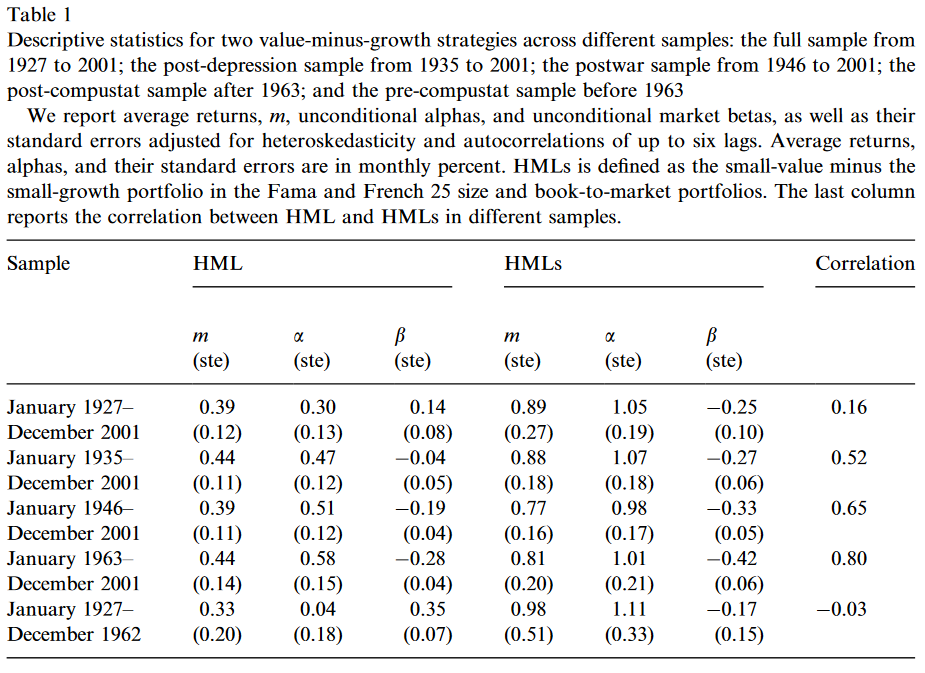

```{r setup, include=FALSE}
knitr::opts_chunk$set(echo = FALSE)
```

## Introduction

### Big Question: 
Does risk affect the value premium and if so, how?


## Introduction

### Previous work
- Value stocks earn higher average returns that growth stocks (Fama and French 1992, 1993)
- One explanation is that risk of value-minus-growth strategies is high in bad times whe expected premium for risk is high, and low in good times when expected premium for risk is low. 

## Introduction

### Previous work
- Risk cannot be source of value premium (Lakonishok 1994). 
    - Value betas higher than growth betas in good times, lower in bad times
- DeBondt and Thaler (1987) and Chopra et al. (1992) find similar evidence
- All conclude value does not expose investors to greater downside risk - must be overreaction


## Introduction

### Previous work
- conditional CAPM performs poorly in short-window market regressions (Lewellen and Nagel 2004)
- value portfolio returns are more highly correlated with consumption growth and growth portfolio in bad times (Lettau and Ludvigson 2001) 

## Introduction

### Contribution

- This paper revisits relative risk of value and growth stocks
- Find time-varying risk goes in right direction explaining value premium
- Value (growth) betas covary positively (negatively) with expected market risk premium


## Introduction

### Contribution

- Previous studies don't find this since they use realized excess return which is noisy
- Should use precise measures like:
    - term spread
    - short-term interest rate
    - dividend yield
    - default spread
- Ex post and ex ante returns are positively correlated - good states ex post are bad ex ante


## Introduction

### Contribution

Covariation between value-minus-growth beta and expected market risk premium too small to explain observed magnitude of value premium in conditional CAPM. 

- Estimated alphas for value-minus-growth strategy positive and significant


## Research Design

### Two Methods

Use sorting and conditional CAPM to compare:

(1) Rolling Beta
(2) Fitted Beta

Against different states of the world and covariance with expected market risk premium


## Sorting

Theory suggests that expected market risk premium is countercyclical. Compare average conditional value and growth betas in these states:

### States of the World

(1) __Peak__ represents lowest 10% of obs of expected market risk premium
(2) __Expansion__ represents remaining months with premium below its average
(3) __Recession__ represents months with the premium above its average except 10% highest
(4) __Trough__ represents months with the 10% highest observations


## Sorting

Need to estimate expected market risk premium $\hat{\gamma_t}$:

$$\hat{\gamma}_t = \hat{\delta}_0 + \hat{\delta}_1DIV_t + \hat{\delta}_2DEF_t + \hat{\delta}_3TERM_t + \hat{\delta}_4TB_t$$
where estimates for each $\delta_n$ are generated from:

$$r_{mt+1} = \delta_0 + \delta_1DIV_t + \delta_2DEF_t + \delta_3TERM_t + \delta_4TB_t + e_{mt+1}$$

where:

 - $DIV_t$ is dividend yield 
 - $DEF_t$ is default spread
 - $TERM_t$ is term spread
 - $TB_t$ is short-term treasury bill rate


## Sorting

Estimate conditional betas in two ways:

(1) first regress value and growth portfolio excess returns on markt excess return using 60-month rolling window (Rolling beta)

(2) Conditional Market Regression

### Fitted Beta

$r_{it+1} = \alpha_i + (b_{i0} + b_{i1} DIV_t + b_{i3} DEF_t + b_{i3} TERM_t + b_{i4} TB_t) r_{mt+1} + \varepsilon_{it+1}$
$$\hat{\beta}_{it} = \hat b_{i0} + \hat b_{i1} DIV + \hat b_{i2} DEF_t + \hat b_{i3} TERM_t + \hat b_{i4} TB_t$$
where $r_{it+1}$ is portfolio $i$'s excess return. 


## Conditional CAPM


### 
- Sorting is informal simple way to study time-varying risk
- Conditional CAPM should more formally serve as benchmark model for asset pricing test


## Conditional CAPM

Conditional beta:

$$\beta_{it} \equiv Cov_t[r_{it+1}, r_{mt+1}] / Var_t[r_{mt+1}]$$
Define $\gamma_t$ as the expected market risk premium. Both $\beta_{it}$ and $\gamma_t$ are conditional on the information set at time $t$. Then, the conditional CAPM says: $\mathbb{E}[r_{it+1}] = \gamma_t \beta_{it}$.

## Conditional CAPM

To measure effects of time-varying risk on average returns use:

$$\mathbb{E}[r_{it+1}] = \bar \gamma \bar \beta_i + Cov[\gamma_t, \beta_{it}] = \bar \gamma \bar \beta_i + Var[\gamma_t]\varphi_i$$

Where $\varphi_i \equiv Cov[\beta_{it}, \gamma_t] / Var[\gamma_t]$ known as the __beta-premium sensitivity__. 


## Beta-premium Sensitivity

- This sensitivity measures the instability of an asset's beta over the business cycle. 
- Stocks with positive $\varphi$ have high risk during recessionary periods when investors dislike risk or when risk is high
    - These stocks earn higher average returns than stocks with low or negative $\varphi$
- _Effect of time-varying beta entirely captured by beta-premium sensitivity_


## Beta-premium Sensitivity

###

- If value stocks expose investors to a greater downside risk, then the beta-premium sensitivities of these stocks will be positive

- Test this hypothesis by fitting the following regression:

$$\hat \beta_{it} = c_i + \varphi_i \hat \gamma_t + \eta_{it}$$
where $H_0: \varphi_i > 0$

- Also test whether growth portfolios have negative beta-premium sensitivities
- Test whether value-minus-growth have positive beta-premium sensitivities


## Estimation

Estimation error could be present in:
$$\hat \beta_{it} = c_i + \varphi_i \hat \gamma_t + \eta_{it}$$

Therefore, simultaneous estimation via GMM is done with a vector of instrumental variables:

$$\textbf{Z}_t = [\textbf{1}, DIV_tDEF_tTERM_tTB_t]$$
Use moment conditions:

$$\mathbb{E}[(r_{mt+1} - \textbf{Z}_t \delta) \textbf{Z}_t'] = 0$$
$$\mathbb{E}[(\hat \beta_{it} - c_i - \varphi_i \textbf{Z}_t \delta)(\textbf{1} \textbf{Z}_t \delta)'] =0 $$

## Estimation
### 
Failing to reject null here suggests value exposes investors to greater downside risk, but does not explain whether conditional CAPM can explain anomaly. Then, to test stronger restriction, look at whether intercepts of value-minus-growth portfolios equal 0


## Data

### 

- Dividend Yield is sum of dividend accruing to CRSP VW market port. over previous 12 months divided by level of market index
- Default Premium is yield spread between Moody's Baa and Aaa
- Term Premium yield spread between one-year and ten-year
- Default yield from FRED
- one-month Treasury bill rate from CRSP

### 
Securities obtained from 1927 to 2001


## Data 

Two strategies:

(1) HML - Value portfolio minus growth portfolio in two-by-three sort on size and B/M
(2) HMLs - small-tock value premium constructed by small-value (Hs) minus small-growth (Ls) portfolio in five-by-five sort on size and B/M. 

Use (2) since value anomaly is strongest in the smallest quintile. 


## Data

- Denote value premium as average returns/unconditional alphas of value-minus-growth portfolios. 
- Value premium exists in the long run, especially among small stocks
- Excluding Great Depression increases unconditional alpha, but not necessarily avg returns
- Post war period (after 1946) increases alpha of HML but decreases for HMLs, with lower average returns for both


## Data




## Time-Varying Risk of Value-Growth Strategy


- Sort conditional betas on expected market risk premium
- Goal is to check whether the betas of value-minus-growth portfolios vary across good and bad times
    - See if differences are reliable
- Estimate beta premium sensitivities $\hat \gamma_t$ using GMM procedure


### Null Hypothesis

Value Portfolios have positive, but growth portfolios have negative beta-premium sensitivities. 


## Results

### Panel A

- HML displays countercyclical pattern of risk in both rolling beta and fitted beta
- No evidence of countercyclical pattern for small-stock value strategy
    - Troublesome for time-varying risk hypothesis since value premium is stronger with smaller stocks
- HML has positive beta-premium sensitivity $\varphi$
    - H has positive $\varphi$ and L has negative $\varphi$
- Hs still has positive $\varphi$, but Ls also has positive $\varphi$
    - HMLs $\varphi$ is negative - value premium stronger among all small firms


## Results


## Results

Excluding Great Depression drastically affects small growth stocks


- Not quite known why small growth stocks are affected so much

## Results 

Time-varying risk in sample is similar, though weaker, than post-depression


- Small number of recessions


## Can Conditional CAPM explain the value premium?

- Value-minus-growth betas correlate positively with expected market risk premium
- Is it big enough to explain observed magnitued of value premium in conditional CAPM?
- Look to see if intercepts from regression are significantly different from zero
- Mostly, intercepts are positive and significant


## Can Conditional CAPM explain the value premium?


## Implications

### Previous Work

- Replicate DeBondt and Thaler (1987) 
- Results no longer hold for time-varying beta

## Conclusion

### Summary

- Time-varying risk goes in the right way to explain the value premium
- Value betas tend to covary positively with expeted market risk premium
- Casts doubt on claim that value cannot be riskier than growth (Behavioral Account)
- Suggests it is true that value firms cannot scale down in bad times, but are more flexible in good times


### Extensions

- Conduct simulations - choose certain known parameter values (value premium) and test all implications 
- Hard to say what is normal - partitioning data


