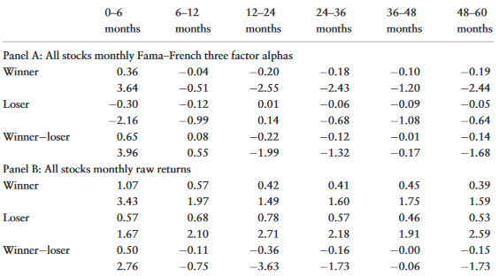
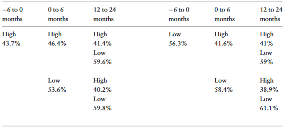
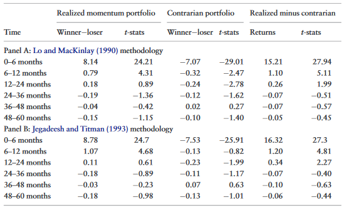
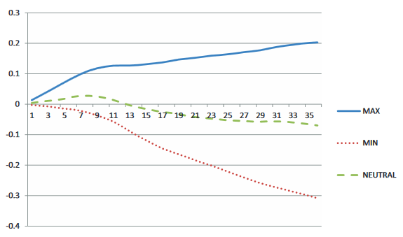
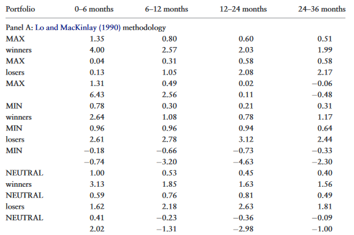
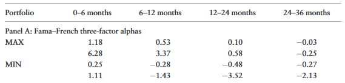
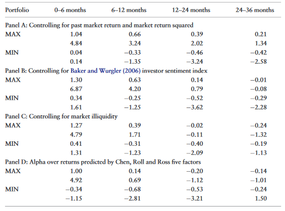

```{r setup, include=FALSE}
knitr::opts_chunk$set(echo = FALSE)
```

## Motivation and Contribution

- Momentum Portfolio buys past winners and sells past losers
- Formerly shown that profits accrue empirically for 6 to 12 months.
- Some studies suggest that momentum is followed by reversal

Does momentum, though, necessarily imply reversals?


## Motivation and Contribution

Connection between Momentum and Reversal

- No pervasive link between short-term momentum and long-run reversal
- First, momentum portfolios with true momentum do not have long-run reversals
- Second, momentum portfolios with reversal in short run continue with reversal in long run. 
- Then, apparent link occurs when portfolios are merged


## Literature

Momentum followed by Reversals

 + Jegadeesh and Titman, 1993
 + Chan, Jegadeesh, and Lakonishok, 1996

Long-Run Reversals Not Significant

 + Fama and French, 1996

Studies that jointly examine momentum and reversals

 + Daniel, Hirshleifer, Subrahmanyam, 1998
 + Barberis, Shleifer, and Vishny, 1998
 + Hong and Stein, 1999


## Research Question and Hypothesis

If momentum and reversal patterns are linked:


## Research Question and Hypothesis

If momentum and reversal patterns are linked:


(1) Portfolios of relative strength should experience both momentum and reversal patterns


## Research Question and Hypothesis

If momentum and reversal patterns are linked:


(1) Portfolios of relative strength should experience both momentum and reversal patterns
(2) Momentum and reversal patterns should happen consecutively


## Research Question and Hypothesis

If momentum and reversal patterns are linked:


(1) Portfolios of relative strength should experience both momentum and reversal patterns
(2) Momentum and reversal patterns should happen consecutively
(3) Strong momentum should predict stronger reversals


## Key Findings

- Realized Momentum Portfolios less likely to exhibit reversal than expected by random chance

## Key Findings

- Realized Momentum Portfolios less likely to exhibit reversal than expected by random chance
- Portfolio of stocks which has momentum in first 6 months does not significantly possess reversal for as long as five years


## Key Findings

- Realized Momentum Portfolios less likely to exhibit reversal than expected by random chance
- Portfolio of stocks which has momentum in first 6 months does not significantly possess reversal for as long as five years
- Reversals keep unwinding - have significant reversal returns in 12-24 month period


## Key Findings

- Realized Momentum Portfolios less likely to exhibit reversal than expected by random chance
- Portfolio of stocks which has momentum in first 6 months does not significantly possess reversal for as long as five years
- Reversals keep unwinding - have significant reversal returns in 12-24 month period
- MAX (MIN) portfolios display momentum (reversal) but no reversal (momentum). 
    - Results hold controlling for illiquidity, asset growth, investment/sales, return on assets


## Key Findings

- Realized Momentum Portfolios less likely to exhibit reversal than expected by random chance
- Portfolio of stocks which has momentum in first 6 months does not significantly possess reversal for as long as five years
- Reversals keep unwinding - have significant reversal returns in 12-24 month period
- MAX (MIN) portfolios display momentum (reversal) but no reversal (momentum). 
    - Results hold controlling for illiquidity, asset growth, investment/sales, return on assets
    
- Some potential sources of momentum do not explain MAX portfolio


## Roadmap

(1) Are Momentum Patterns Linked?
(2) Identifying Stocks with Momentum versus Reversal
(3) Understanding Sources of Momentum


## Are Momentum Patterns Linked? - Data

- All CRSP stocks (share code 10, 11) on NYSE, Amex, and Nasdaq
- January 1965 thorugh December 2010


Define a stock as _winner_ (_loser_) if prior six month return is higher (lower) than the average prior six month return of all stocks. 


## Are Momentum Patterns Linked? - Data

- All CRSP stocks (share code 10, 11) on NYSE, Amex, and Nasdaq
- January 1965 thorugh December 2010


Define a stock as _winner_ (_loser_) if prior six month return is higher (lower) than the average prior six month return of all stocks. 

First Finding: Typical WML portfolio has returns consistent with prior studies: momentum followed by reversals


## Are Momentum Patterns Linked? - Data





## Are Momentum Patterns Linked? - Test 1

- Separate momentum portfolio into two subcomponents
    + Realized Momentum
    + Contrarian
    
## Are Momentum Patterns Linked? - Test 1





## Are Momentum Patterns Linked? - Result 1


On average, 46% of realized momentum stocks exhibit some reversal, which is statistically significantly less than the 50% we would expect if there were no relation between the momentum and reversal. 

But, 50% of securities in contrarian portfolio experience reversals in 12-24 month period. 

- Then, stocks that do not contribute to momentum are more likely to reverse. 


## Are Momentum Patterns Linked? - Test 2

What about magnitude of reversals?

- Consider return continuation and reversals as anomalous
- Use Fama-French three factor-adjusted returns to get size of alpha


## Are Momentum Patterns Linked? - Results 2





## Are Momentum Patterns Linked? - Summary


_If momentum and reversal pattersn are linked, a winner (loser) from the formation period will over- (under-)perform in the intermediate term, and then go on to under- (over-)perform._


- Significantly less portion of realized momentum stocks reverse
- Contrarian stocks more likely to reverse
- Significant positive (negative) alpha for realized momentum (contrarian) portfolio


## Identifying Stocks with Mom versus Rev - Method 

_If we can identify at the time of portfolio formation, those securities that are likely to experience momentum or reversal, we may be able to better understand the sources of these return patterns._

- Form size and book-to-market ratio-based portfolios that differ in expected returns
- Put into three (tercile) groups based on market capitalization and book to market ratio:
    (1) High Risk - high risk stocks according to one measure and medium risk for the other
    (2) Low Risk  - low risk stocks according to one measure and medium risk for the other
    (3) Medium Risk - All other stocks
    
    
    
## Identifying Stocks with Mom versus Rev - Method 


MAX Portfolio:

- Highest Risk tercile winners
- Lowest Risk tercile losers
- Buys high B/M and small winners
- Sells low B/M and large losers

Min Portfolio:

- Lowest Risk tercile winners
- Highes Risk tercile losers

Neutral:
- All other stocks


## Identifying Stocks with Mom versus Rev - Method 


- After sorting, look at monthly raw returns
- Adjust for risk 


## Identifying Stocks with Mom versus Rev - Results 

    



## Identifying Stocks with Mom versus Rev - Results 





## Identifying Stocks with Mom versus Revl - Results 

Use multiple models for generating risk-adjusted returns:

- Fama-French 3-factor alphas
- Rolling Regressions - Fama-Frence 3-factor
- Conditional Fama-French
- Fama-French 5-factor
- Pastor-Stambaugh 4-factor
- Characteristic-matched returns (3x3 and 10x10 size and book-to-market sorts)
- Charhart four-factor

No matter what the test, results are consistent with using standard FF 3-factor alpha


## Identifying Stocks with Mom versus Rev - Results 





## Understanding Sources of Momentum 


Within these portfolios, what can explain some of the persistent returns from momentum?

Look at relation to:

(1) Behavioral Bias


## Understanding Sources of Momentum 


Within these portfolios, what can explain some of the persistent returns from momentum?

Look at relation to:

(1) Behavioral Bias
(2) Investor Sentiment


## Understanding Sources of Momentum 


Within these portfolios, what can explain some of the persistent returns from momentum?

Look at relation to:

(1) Behavioral Bias
(2) Investor Sentiment
(3) Liquidity Constraints


## Understanding Sources of Momentum 


Within these portfolios, what can explain some of the persistent returns from momentum?

Look at relation to:

(1) Behavioral Bias
(2) Investor Sentiment
(3) Liquidity Constraints
(4) Macroeconomic factors


## Behavioral Bias

Market States - lagged returns of overall market 

    + Proxy for behavioral bias
    + Aggregrate Investor Confidence
    
- Regress cumulative returns of momentum portfolio on risk factors
- Examine relation between residuals of regression and past market returns and its square


## Behavioral Bias

- Standard momentum portfolio returns are explained by lagged market returns
- MAX portfolio returns not explained by lagged market returns
- Lagged Market Returns explain MIN portfolio


Then, lagged market returns are not an important determinant of MAX returns


## Investor Sentiment Index


- Use sentiment index
- Average 6 months prior to portfolio formation
- Regress momentum portfolio returns on avg sentiment with FF 3-factor


Sentiment Index is correlated with standard momentum portfolio (nonsignificance at 10% level)
Not significant for MAX portfolio


## Market Illiquidity and Arbitrage Constraints


Momentum returns should be higher in liquid markets (Avramov, Cheng, and Hameed, 2014)

- Regress momentum portfolio returns on market illiquidity and FF 3-factors. 

- Significant negative correlation between illiquidy and returns for standard portfolio

- Negative but nonsignificant for MAX and MIN portfolio


## Macroeconomic Factors


Test for undiscovered risk factor, such as business cycle

- Estimate predicted returns using macro factors (Chen, Roll, and Ross, 1986)
    (1) change in monthly industrial production
    (2) unexpected inflation
    (3) change in expected inflation
    (4) term premium
    (5) default premium
    


## Macroeconomic Factors

- Macro Factors explain a large portion of momentum returns
- Still are significant returns for MAX portfolio


## Understanding Sources of Momentum





## Summary


## Extension

(1) What explains positive abnormal returns of MAX portfolio? Why is MIN explained?
(2) Are categorizations of "high risk" and "low risk" from market cap and book-to-market sufficient? Are there better metrics?
(3) Are results given by construction - would one expect high returns from how portfolios were created?


