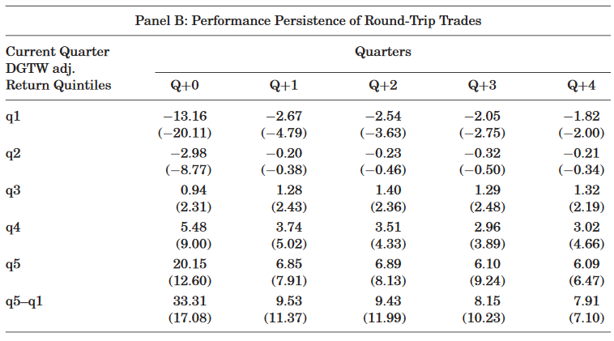

```{r setup, include=FALSE}
knitr::opts_chunk$set(echo = FALSE)
```


## Introduction

### Overview

- Examines interim (intra-quarter) trading skills of institutional investors using ANcerno data
- Find strong evidence that investors earn significant abnormal returns on trades within trading quarter
- Interim trading is persistent
- Trading skills documented by previous studies are biased downward since they cannot account for interim trades


## Introduction

### Related Literature

- Stocks that mutual funds purchase earn higher returns than the stocks they sell 
    - Chen, Jegadeesh and Wermers (2000), Kacperczyk, Sialm, and Zheng (2005), and more
- Trading performance has since declined or reversed in recent times
    - Duan, Hu, McLean (2009)
- Conflicting results whether institutional traders can predice future stock returns
    - Bennett, Sias, and Starks (2003), Cai and Zheng (2004)
    
 
## Introduction


__Claim:__ Previous studies have used quarterly trading data as a proxy which cannot adequately capture intraquarter data, limiting this proxy:

(1) Quarterly data cannot capture buys and sells of the same stock inbetween quarters
(2) Quarterly holdings cannot identify exact timing and execution of trades

Previous studies assume all trades occur at the end of the quarter, but they can occur at any time. This can limit the researcher in properly assessing superior trading skills


## Data

### Solution:

Use ANcerno!

- Identifies exact date and execution price of each transaction for each stock.
- Gives number of stocks traded
- Commissions
- Buy or Sell
- Distinguishes trades made by different institutions

### Limitation

There is no information on management fees or fund returns


## Data

- Sample period 1999 - 2005
- 840 different institutions in sample period
- 3,816 different funds within those institutions
- Trading activity in sample accounts for 8% of dollar value of trading volume in CRSP
- Of the 3,816 funds:
    - 227 Money Managers
    - 3,589 pension funds
    


## Data 

\


## Data 

\


## Data 

- Additionally, complement data with:
    - CRSP
    - Compustat
    - TAQ
    
    
    
    
## Database Integrity

### No Survivorship Bias

(1) ANcerno says so
(2) Not all sample firms are present by the end of the sample
(3) Authors collected data year by year


## Database Integrity

### No Selection Bias

(1) ANcerno clients may be different than the average institution
    - no names of institutions given
    - ANcerno provided offers with some names
    - Compare changes in quarterly holdings between ANcerno and 13F
(2) Authors find that characteristics of stock holdings of ANcerno does not differ from average 13F
(3) ANcerno may not represent random selection of firm holdings and trades
    - Nature of ANcerno should not give this incentive of firms to misreport
    


## Methodology

### Intraquarter Round-trip trades

(1) Select all trades in a quarter where firm buys and sells particular stock
(2) Calculate Holding Period return
(3) Subtract DGTW return to get abnormal return
(4) Compute average principal-weighted raw and abnormal return, with and without commissions, of all round-trip trades for each fund during each quarter


## Methodology


\


### Example

- IBM holding period return is $11.1\% = ((\$100-\$90) / \$90)$
- MSFT is $-4.76\% = ((\$40-\$42) / \$42)$
- Take principle-weighted raw average where:
    - IBM has $.6818 = (\$9000 / \$13200)$ and MSFT $0.3182 = (\$4200 / \$13200)$ 
    - Total Turn then is $6.06\%$
  


## Methodology

### All Trades
(1) For each fund separate all trades within the quarter into buys and sells
(2) Track performance of each trade until the end of the quarter
(3) Subtract DGTW Benchmark return over same period
(4) Compute equal and principle weighted abnormal return for buys and sells separately
(5) Calculate difference in return before and after commission


## Methodology

\


## Methodology 

### Example

- Buy trades have holding period return of $16.67\%$ and $2.5\%$ for IBM and GE
- Sell trades have $5.0\%$ and $-4.17\%$ for IBM and AAPL
- Assume DGTW is 0, and we have EW return of: $(9.59\% - 0.42\%) = 9.17\%$


## Empirical Results - Round Trip Trades

### Hypothesis

If funds possess trading skill, their abnormal round-trip trading perfomcance will be positive


## Empirical Results - Round Trip Trades

### Table 2
\


## Empirical Results - Round Trip Trades Persistence

### Table 2
\


## Concerns

- Mechanical Factors from rebalancing
- Behavioral Bias - selling winners to quickly, holding losers too long

### Solution

Look at all trades measured from earlier


## Empirical Results - All Trades

### Hypothesis 

If funds have trading skills, then the stocks a fund bus will outperform the stocks it sells


- Some trades might be due to fund flows and rebalancing
- Will bias against study of finding evidence of trading skill


## Empirical Analysis - All Trades


### Table 3
\


## Empirical Analysis - All Trades


### Table 3
\


## Empirical Analysis - All Trades

### Table 4
\


## Empirical Analysis - All Trades

### Table 4
\


## Implied Quarterly Trades

Results support hypothesis that institutions possess significant interim trading skill

### Question

What if we ignore round-trip trades and timing of interim trades within the quarter? 


## Implied Quarterly Trades - Method

(1) For each fund and each stoc, aggregate all trades in quarter
(2) Calculate cumulative net trading position as of the quarter-end
(3) Calculate DGTW equal and principle weighted returns for buys and sells, get abnormal returns
(4) Compute difference between abnormal returns buys and sells

Implicitly assumes all trades occur at the closing price on the last day of the quarter


## Implied Quarterly Trades - Results

\


## Implied Quarterly Trades - Persistence

\


## Sources of Trading Skill

\


## Illiquidity?

### Question

Does compensation for liquidity provision drive interim trading performance? If so, funds with higer interim trading performance should experience lower or negative implicity trading costs. 


### Result

High-skill funds incur higher implicit trading costs - more likely to demand liquidity


## Illiquidity

\


## Robustness

- Trading performance and trading horizon does not appear to be correlated
- Using FIFO and LIFO give similar results
- Pre- and Post-bubble (tech) yields similar results
- Some success is determined by insitutional-level factors
- Funds with the highest dinterim trading performance have higher monthly fund alphas


## Conclusion

- Authors seek to sort out the real story of trading skills of institutional investors
- Use interim (intraquarter) data whereas former studies use discrete quarterly
- Show that institutional investors do have above average skill, and it persists
- Using same data but with discrete quarterly measures nullify results
- Illiquidity appears to be important factor, and indicates asymmetric information with arbitrage


### Questions

- How long do winners win? Persistence more than 4 quarters? Where should I put my money in long-run?
- 1999 - 2005 sample too small?


